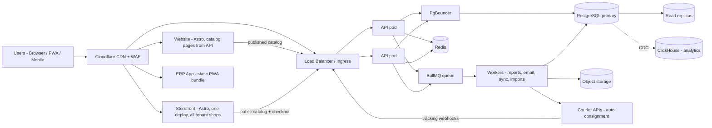

# Omnivo

**Omnivo is a multi-tenant, cloud ERP built for small and mid-sized businesses. It is fast, light, works offline, and runs well on mobile.**

One platform for accounting, inventory, sales, purchasing, POS, HR and payroll. Every company (tenant) gets its own isolated workspace, such as `acme.omnivo.app`, and can keep working when the internet drops.

> 📘 **Why** the system is built this way — full architecture, scaling strategy and trade-offs, in Bangla: **[docs/system-design.bn.md](docs/system-design.bn.md)**
>
> 🛠️ **What gets built, in what order** — the step-by-step build plan with time estimates, in Bangla: **[docs/build-plan.bn.md](docs/build-plan.bn.md)**
>
> 🧭 Architecture decision records (ADRs) are in [docs/adr/](docs/adr/). The first is [0001: PostgreSQL over MongoDB](docs/adr/0001-postgresql-over-mongodb.md).

---

## What we are building

| Product | Description | Audience |
|---|---|---|
| **Omnivo App** | The ERP web app (PWA). Offline-first, mobile responsive. | Tenant users |
| **Omnivo API** | Multi-tenant backend (modular monolith) | App, integrations |
| **Omnivo Website** | Marketing site, landing page, pricing, blog, docs, and checkout where customers buy plans, modules and add-ons | Prospects, customers |
| **Omnivo Admin** | Internal console for tenants, billing and support. It also manages the product catalog: which plans, modules and add-ons exist, their prices, and which ones the website shows | Omnivo team |
| **Omnivo Storefront** | A public online shop for each tenant (`acme.omnivo.shop` or their own domain). Their customers browse products and order with cash on delivery or online payment; every order becomes a sales order and an automatic courier consignment. Controlled by the tenant from the ERP app | Tenants' own customers |
| **Omnivo Mobile** *(later)* | Native wrapper around the PWA (Capacitor) for POS and field sales | Tenant users |

> ⚠️ **Website and Storefront are two different things.** The *Website* is where businesses buy Omnivo. A *Storefront* is where a tenant's own customers buy that tenant's products. The design, data model, order flow and courier integration are in section 14 of [docs/system-design.bn.md](docs/system-design.bn.md).

## Core principles

1. **Multi-tenant from day one.** Every row, cache key, job, file and log line is scoped to a tenant.
2. **Fast by default.** p95 API latency under 200 ms. The initial app JS bundle is under 200 KB gzipped. Pages load instantly from the local cache.
3. **Offline-first where it matters.** POS, inventory counts, sales orders and expenses keep working without a connection and sync when it comes back.
4. **Modular monolith first, microservices only when proven necessary.**
5. **Money is sacred.** Double-entry ledger, no floats, and immutable audit trails.
6. **Boring, proven technology.** PostgreSQL, Redis, TypeScript and Docker.

## Modules

**Phase 1 (MVP):** Core platform (tenants, users, roles and permissions, audit log), Accounting and Finance, Inventory, Sales and Invoicing, Purchasing, POS, Reports and Dashboard

**Phase 2:** HR and Payroll, CRM, Expense management, Multi-branch and multi-warehouse, Local tax and VAT compliance, Storefront (public online shop with COD and online payment) and courier delivery

**Phase 3:** Manufacturing (BOM, work orders), Projects and Timesheets, E-commerce integrations, Public API and Webhooks, AI assistant and forecasting

## Tech stack (summary)

| Layer | Choice |
|---|---|
| Monorepo | pnpm workspaces + Turborepo |
| Language | TypeScript (end to end) |
| ERP frontend | React + Vite, TanStack Router/Query/Table, Tailwind CSS, shadcn/ui |
| Offline | PWA (Workbox service worker), IndexedDB, sync engine using an outbox pattern |
| Website / landing | Astro (static, near-zero JS) |
| Tenant storefront | Astro (server-rendered, CDN-cached, multi-tenant by domain) |
| Backend | NestJS on the Fastify adapter (modular monolith) |
| Validation / contracts | Zod schemas shared by frontend and backend |
| ORM | Drizzle ORM |
| Database | PostgreSQL 17 with Row-Level Security; Citus for sharding later |
| Connection pooling | PgBouncer |
| Cache / queue | Redis (Valkey) + BullMQ |
| Search | Meilisearch (later OpenSearch) |
| Analytics / reports | ClickHouse (from Phase 2) |
| File storage | S3-compatible storage (Cloudflare R2 / AWS S3) |
| Auth | OIDC (Zitadel or Keycloak), short-lived JWT, RBAC |
| Billing | Stripe + SSLCommerz / bKash (Bangladesh) |
| Storefront payments | Tenant's own gateway: SSLCommerz, bKash, Nagad, or cash on delivery |
| Courier | Adapter per provider: Pathao, Steadfast, RedX, eCourier, Paperfly (+ manual fallback) |
| Infrastructure | Docker, Kubernetes (k3s → EKS/GKE), OpenTofu (Terraform) |
| CDN / edge / WAF | Cloudflare |
| CI/CD | GitHub Actions, Argo CD |
| Observability | OpenTelemetry, Prometheus, Grafana, Loki, Tempo, Sentry |

The Bangla design document explains the reason, benefits and trade-offs behind each choice.

## High-level architecture



## Planned repository structure

```
omnivo/
├── apps/
│   ├── web/            # Astro — marketing site, landing, pricing, blog
│   ├── shop/           # Astro — tenant storefronts (multi-tenant by domain)
│   ├── app/            # React + Vite — ERP PWA
│   ├── admin/          # React — internal admin console (tenants, billing, product catalog)
│   ├── api/            # NestJS — modular monolith
│   └── worker/         # Background jobs (BullMQ)
├── packages/
│   ├── ui/             # Shared design system (shadcn/ui + Tailwind)
│   ├── contracts/      # Zod schemas and shared types (API contracts)
│   ├── db/             # Drizzle schema, migrations, seed
│   ├── sync/           # Offline sync engine (client + server protocol)
│   ├── i18n/           # English + Bangla translations
│   └── config/         # Shared eslint, tsconfig, tailwind presets
├── infra/
│   ├── docker/         # Dockerfiles, docker-compose for local dev
│   ├── k8s/            # Helm charts / manifests
│   └── terraform/      # OpenTofu IaC
├── docs/
│   ├── system-design.bn.md   # architecture and why
│   ├── build-plan.bn.md      # step-by-step build order
│   └── adr/                  # architecture decision records
└── .github/workflows/  # CI/CD
```

## Pricing (draft)

| Plan | Target | Includes |
|---|---|---|
| **Free** | Freelancers, trial | 1 user, 1 branch, basic accounting and invoicing |
| **Starter** | Small shops | Up to 5 users, Accounting, Inventory, Sales, POS |
| **Growth** | Growing SMBs | Up to 25 users, all Phase 1–2 modules, multi-branch, API |
| **Enterprise** | Large businesses | Unlimited users, dedicated database, SSO, SLA, custom domain |

Paid plans are billed monthly or yearly (yearly gets 2 months free). Add-on modules can be purchased separately.

Storefront is a Phase 2 feature sold through the same catalog, gated by the `feature.storefront` entitlement rather than hard-coded plan checks.

The table above is only a starting point. Plans, prices and what the website shows are **not hard-coded**: they live in the product catalog and are managed from the Admin panel. Pricing and product pages are rendered on the server, cached at the CDN, and refreshed when an admin publishes a change. Prices are versioned, so existing subscribers keep their price when it changes. Details are in section 13.3 of [docs/system-design.bn.md](docs/system-design.bn.md).

## Getting started

> The codebase is not scaffolded yet. The intended local workflow is:

```bash
pnpm install
docker compose -f infra/docker/docker-compose.yml up -d   # postgres, redis, meilisearch
pnpm db:migrate
pnpm dev                                                  # runs all apps via turbo
```

## Roadmap

| Steps | What | Milestone |
|---|---|---|
| 0–3 | Monorepo scaffold, CI, local Docker environment, database foundation with row-level security, auth and RBAC | Signup → login → tenant dashboard |
| 4–5 | Shared design system, contract and typed-client codegen pipeline | Every new endpoint reaches the UI type-safe |
| 6–8 | Core platform: settings, branches, numbering, audit log, users and roles, queue and worker, transactional outbox | First async job running |
| 9–11 | Accounting: chart of accounts, double-entry journal, financial statements | A trial balance that balances |
| 12–14 | Inventory: products with batch/serial tracking, append-only stock ledger, valuation posting to the ledger | Stock receipt moves the balance sheet |
| 15–17 | Sales and Purchasing, invoice PDF | Invoice → stock → ledger → PDF |
| 18–20 | Offline sync engine, PWA shell, POS | Selling with the network off |
| 21 | Reports and dashboard | 🏁 **MVP** |
| 22–24 | Website, admin console, product catalog, billing | Publish a price, the site shows it |
| 25 | Observability, backups, security review, closed beta | 🚀 **Public launch** |
| 26–28 | Storefront (COD + online payment) and courier auto-consignment | Order → sales order → consignment → COD reconciliation |
| 29+ | HR and Payroll, CRM, VAT compliance, mobile app, public API, manufacturing | |

Each step lists what to build on both sides, what you should be able to see in the browser when it is done, and a time estimate: **[docs/build-plan.bn.md](docs/build-plan.bn.md)**.

## License

Proprietary © Omnivo. All rights reserved.
