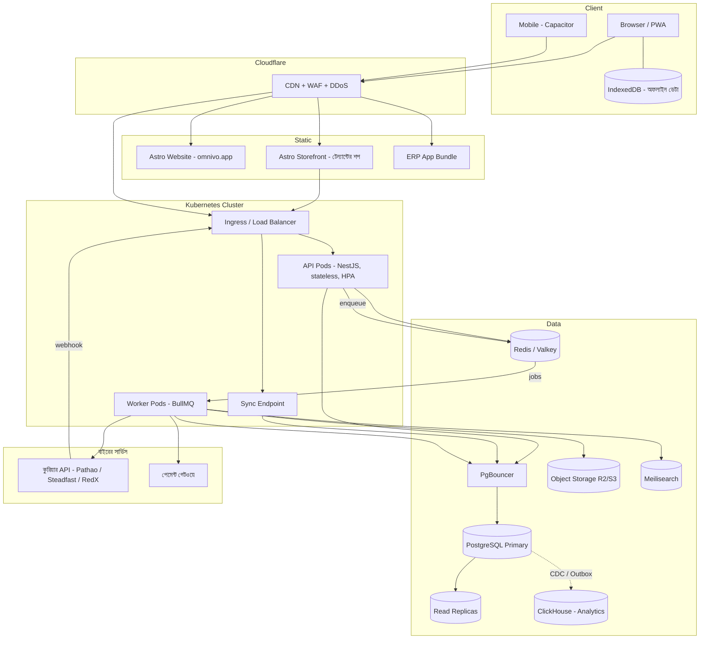
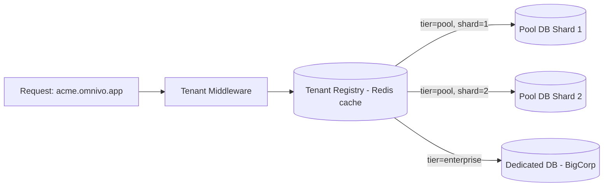
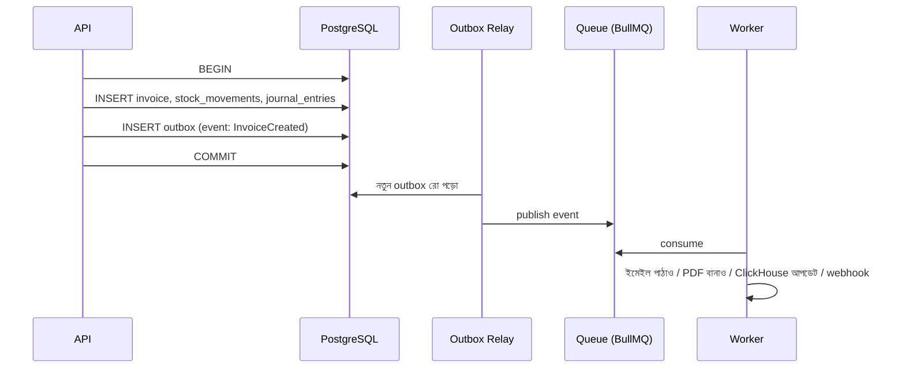
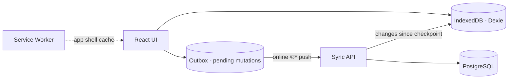
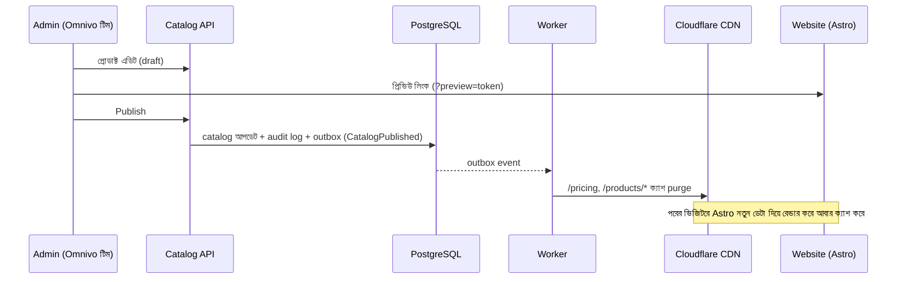
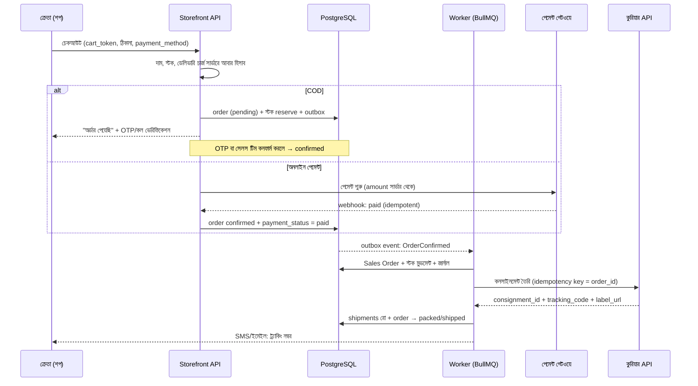

# Omnivo — সিস্টেম ডিজাইন ও আর্কিটেকচার গাইড (বাংলা)

> **Omnivo**: মাল্টি-টেন্যান্ট, অফলাইন-সাপোর্টেড, মোবাইল-ফ্রেন্ডলি, হালকা ও দ্রুত ক্লাউড ERP।
> এই ডকুমেন্টটি একজন সিস্টেম ডিজাইনার ও DevOps ইঞ্জিনিয়ারের দৃষ্টিকোণ থেকে লেখা। এখানে কী ব্যবহার করবেন, কেন করবেন, তার সুবিধা কী, কোথায় সমস্যা হতে পারে আর কীভাবে ধাপে ধাপে মিলিয়ন ইউজার পর্যন্ত স্কেল করবেন, সব আছে।

---

## সূচিপত্র

0. [এক নজরে মূল সিদ্ধান্ত (TL;DR)](#০-এক-নজরে-মূল-সিদ্ধান্ত-tldr)
1. [লক্ষ্য ও Non-Functional Requirements](#১-লক্ষ্য-ও-non-functional-requirements)
2. [সামগ্রিক আর্কিটেকচার: কেন Modular Monolith](#২-সামগ্রিক-আর্কিটেকচার-কেন-modular-monolith)
3. [Tech Stack: কী, কেন, সুবিধা, সমস্যা](#৩-tech-stack-কী-কেন-সুবিধা-সমস্যা)
4. [Multi-Tenancy ডিজাইন](#৪-multi-tenancy-ডিজাইন)
5. [মিলিয়ন ইউজার হ্যান্ডেল করা: স্কেলিং স্ট্র্যাটেজি](#৫-মিলিয়ন-ইউজার-হ্যান্ডেল-করা-স্কেলিং-স্ট্র্যাটেজি)
6. [পারফরম্যান্স: হালকা ও সুপার ফাস্ট রাখার নিয়ম](#৬-পারফরম্যান্স-হালকা-ও-সুপার-ফাস্ট-রাখার-নিয়ম)
7. [অফলাইন সাপোর্ট (Offline-First)](#৭-অফলাইন-সাপোর্ট-offline-first)
8. [মোবাইল রেসপন্সিভ ও মোবাইল অ্যাপ](#৮-মোবাইল-রেসপন্সিভ-ও-মোবাইল-অ্যাপ)
9. [মডিউল: কোনগুলো সবচেয়ে জরুরি](#৯-মডিউল-কোনগুলো-সবচেয়ে-জরুরি)
10. [ERP-নির্দিষ্ট ডেটা ডিজাইনের নিয়ম](#১০-erp-নির্দিষ্ট-ডেটা-ডিজাইনের-নিয়ম)
11. [সিকিউরিটি](#১১-সিকিউরিটি)
12. [DevOps: CI/CD, Infra, Monitoring, Backup](#১২-devops-cicd-infra-monitoring-backup)
13. [Billing, Pricing Plan ও Feature Gating](#১৩-billing-pricing-plan-ও-feature-gating)
14. [Storefront: টেন্যান্টের পাবলিক অনলাইন শপ ও কুরিয়ার ডেলিভারি](#১৪-storefront-টেন্যান্টের-পাবলিক-অনলাইন-শপ-ও-কুরিয়ার-ডেলিভারি)
15. [বাংলাদেশ-নির্দিষ্ট বিষয়](#১৫-বাংলাদেশ-নির্দিষ্ট-বিষয়)
16. [আনুমানিক খরচ](#১৬-আনুমানিক-খরচ)
17. [রোডম্যাপ ও টিম](#১৭-রোডম্যাপ-ও-টিম)
18. [যে ভুলগুলো অবশ্যই এড়াবেন](#১৮-যে-ভুলগুলো-অবশ্যই-এড়াবেন)
19. [ফাইনাল চেকলিস্ট](#১৯-ফাইনাল-চেকলিস্ট)

---

## ০. এক নজরে মূল সিদ্ধান্ত (TL;DR)

| বিষয় | সিদ্ধান্ত | এক লাইনে কারণ |
|---|---|---|
| আর্কিটেকচার | **Modular Monolith** + Background Workers | দ্রুত ডেভেলপমেন্ট, কম খরচ; পরে দরকার হলে মডিউল আলাদা সার্ভিস করা যাবে |
| ভাষা | **TypeScript** (ফ্রন্টএন্ড + ব্যাকএন্ড) | একই টাইপ ও ভ্যালিডেশন দুই দিকে, ছোট টিমে সবচেয়ে বেশি গতি |
| ব্যাকএন্ড | **NestJS + Fastify adapter** | মডিউলার স্ট্রাকচার, DI, দ্রুত HTTP লেয়ার |
| ডাটাবেস | **PostgreSQL 17** + Row-Level Security | ACID, ERP-এর জন্য সবচেয়ে নির্ভরযোগ্য, RLS দিয়ে টেন্যান্ট আইসোলেশন |
| Multi-tenancy | **Hybrid**: shared DB (ছোট টেন্যান্ট) + dedicated DB (Enterprise) | খরচ কম, আবার বড় ক্লায়েন্টের জন্য আইসোলেশন |
| ERP ফ্রন্টএন্ড | **React + Vite SPA (PWA)** | লগইনের পেছনের অ্যাপে SSR লাগে না; অফলাইনের জন্য SPA সবচেয়ে ভালো |
| ওয়েবসাইট/ল্যান্ডিং | **Astro** | স্ট্যাটিক HTML, প্রায় শূন্য JS, SEO ও স্পিড সেরা |
| অফলাইন | **PWA + IndexedDB + Outbox Sync** | ইন্টারনেট না থাকলেও POS/বিক্রি চলবে |
| Cache/Queue | **Redis (Valkey) + BullMQ** | সহজ, দ্রুত, একটা টুলে দুই কাজ |
| Infra | শুরুতে **Docker Compose / k3s**, পরে **Kubernetes (EKS/GKE)** | শুরুতে কম খরচ, পরে অটো-স্কেল |
| CDN/সিকিউরিটি | **Cloudflare** | ফ্রি টিয়ারেই CDN, WAF, DDoS সুরক্ষা |
| Observability | **OpenTelemetry + Grafana stack + Sentry** | ভেন্ডর লক-ইন নেই |
| টেন্যান্টের অনলাইন শপ | **Storefront** (Astro SSR + CDN, `acme.omnivo.shop`) | টেন্যান্ট নিজের প্রোডাক্ট বিক্রি করবে, স্টক ও হিসাব একই ERP-তে |
| ডেলিভারি | **কুরিয়ার অ্যাডাপ্টার** (Pathao, Steadfast, RedX…), অর্ডার কনফার্ম হলেই অটো কনসাইনমেন্ট | হাতে বুকিং বন্ধ, COD-র টাকা অটো রিকনসাইল |

> **সবচেয়ে গুরুত্বপূর্ণ কথা:** প্রথম দিন থেকে মিলিয়ন ইউজারের জন্য জটিল সিস্টেম বানাবেন না। বানাবেন এমন একটা সিস্টেম যেটা **সহজ**, কিন্তু যার **ডিজাইন স্কেল করার পথ খোলা রাখে**। প্রতিটা টেবিলে `tenant_id`, stateless API আর async jobs, এই তিনটা ঠিক থাকলে পরে স্কেল করা অনেক সহজ।

---

## ১. লক্ষ্য ও Non-Functional Requirements

মাপা যায় এমন লক্ষ্য ঠিক না করলে "সুপার ফাস্ট" কথাটার কোনো অর্থ থাকে না। তাই শুরুতেই সংখ্যা ঠিক করুন:

| মেট্রিক | টার্গেট |
|---|---|
| API latency (p95) | < 200 ms (সাধারণ CRUD < 80 ms) |
| API latency (p99) | < 500 ms |
| ফার্স্ট লোড (4G মোবাইল) | < 2.5 s (LCP) |
| পরের লোড (ক্যাশ থেকে) | < 1 s, অফলাইনেও খুলবে |
| ইনিশিয়াল JS বান্ডেল | < 200 KB gzipped |
| Uptime (SLA) | 99.9% (মাসে ~৪৩ মিনিট ডাউনটাইম), Enterprise-এ 99.95% |
| RPO (কতটুকু ডেটা হারানো চলবে) | ≤ 5 মিনিট |
| RTO (কত দ্রুত ফিরে আসবে) | ≤ 1 ঘণ্টা |
| টেন্যান্ট ডেটা লিক | **শূন্য**। এটা নিয়ে কোনো ছাড় নেই |

### "মিলিয়ন ইউজার" বাস্তবে কতটা লোড?

হিসাবটা আগে করে নিন, তাহলে অকারণে over-engineering করবেন না:

```
রেজিস্টার্ড ইউজার:            1,000,000
দৈনিক সক্রিয় (DAU ~15%):       150,000
পিক সময়ে একসাথে সক্রিয় (~10%):   15,000
প্রতি ইউজার গড়ে ১টা রিকোয়েস্ট / ৫ সেকেন্ড
=> পিক লোড ≈ 3,000 req/sec (সেফটি মার্জিনসহ ~6,000 RPS)
```

- একটা Node.js (Fastify) pod সাধারণ CRUD-এ **১,০০০–৩,০০০ RPS** সামলাতে পারে। মানে **৫–১০টা pod** যথেষ্ট।
- ভালো ইনডেক্সসহ একটা বড় PostgreSQL instance **১০,০০০+ TPS** সামলাতে পারে।
- **উপসংহার:** মিলিয়ন ইউজারের জন্য মাইক্রোসার্ভিস বা শুরু থেকে sharding লাগে না। দরকার **ভালো ইনডেক্সিং, ক্যাশিং, read replica আর async processing**। বটলনেক প্রায় সবসময় **ডাটাবেস** হয়, প্রোগ্রামিং ভাষা না।

---

## ২. সামগ্রিক আর্কিটেকচার: কেন Modular Monolith

### তিনটা অপশনের তুলনা

| | Monolith (এলোমেলো) | **Modular Monolith** ✅ | Microservices |
|---|---|---|---|
| ডেভেলপমেন্ট স্পিড | শুরুতে দ্রুত, পরে ধীর | দ্রুত এবং টেকসই | ধীর |
| অপারেশন খরচ | কম | কম | অনেক বেশি |
| ডিবাগিং | সহজ | সহজ | কঠিন (distributed tracing লাগবে) |
| ট্রানজ্যাকশন (ERP-তে জরুরি) | সহজ | সহজ (একই DB transaction) | কঠিন (Saga লাগবে) |
| টিম সাইজ | ১–৫ | ১–৩০ | ৩০+ |
| পরে ভাগ করা | কঠিন | সহজ | — |

**ERP-তে microservices বিশেষ করে বিপজ্জনক**, কারণ একটা সেলস ইনভয়েস একসাথে Sales, Inventory আর Accounting তিনটা মডিউলে লেখে। এক DB transaction-এ এটা খুব সহজ। তিনটা আলাদা সার্ভিসে করলে distributed transaction লাগে, যেটা ব্যর্থ হলে হিসাব মিলবে না।

### Modular Monolith মানে কী

- কোড **একটাই ডিপ্লয়যোগ্য অ্যাপ**, কিন্তু ভেতরে প্রতিটা মডিউল (Accounting, Inventory, Sales…) আলাদা বক্স।
- এক মডিউল অন্য মডিউলের **টেবিলে সরাসরি হাত দেবে না**। শুধু তার public service/interface বা event ব্যবহার করবে।
- মডিউলের মধ্যে যোগাযোগ দুইভাবে হবে:
  1. **Synchronous**: সরাসরি service call (একই transaction-এ দরকার হলে)
  2. **Asynchronous**: Domain Events + **Transactional Outbox** (যেমন "ইনভয়েস তৈরি হলো, তাই ইমেইল পাঠাও" বা "রিপোর্ট আপডেট করো")

```
apps/api/src/modules/
├── core/          # tenant, user, role, permission, audit, settings
├── accounting/    # chart of accounts, journal, ledger, tax
│   ├── domain/        # entity, business rules (framework-মুক্ত)
│   ├── application/   # use-cases / commands / queries
│   ├── infra/         # repository, drizzle queries
│   ├── api/           # controllers, DTO
│   └── index.ts       # শুধু এটাই বাইরে export হবে
├── inventory/
├── sales/
├── purchase/
├── pos/
├── storefront/    # পাবলিক অনলাইন শপ, কার্ট, চেকআউট, অর্ডার (§১৪)
├── shipping/      # কুরিয়ার অ্যাডাপ্টার, কনসাইনমেন্ট, ট্র্যাকিং, COD রিকনসিলিয়েশন (§১৪)
└── hr/
```

> **টিপস:** `eslint-plugin-boundaries` বা `dependency-cruiser` দিয়ে CI-তে নিয়ম চালু করুন: "sales মডিউল inventory-র infra ফোল্ডার import করতে পারবে না।" এতে মনোলিথ এলোমেলো হয়ে যাবে না।

### হাই-লেভেল আর্কিটেকচার



---

## ৩. Tech Stack: কী, কেন, সুবিধা, সমস্যা

### ৩.১ ব্যাকএন্ড ভাষা: TypeScript নাকি Go?

| | **TypeScript (Node.js)** ✅ প্রস্তাবিত | Go |
|---|---|---|
| পারফরম্যান্স | ভালো (I/O-bound কাজে যথেষ্ট) | খুব ভালো, কম মেমোরি |
| ডেভেলপমেন্ট স্পিড | খুব দ্রুত | মাঝারি |
| ফ্রন্টএন্ডের সাথে কোড শেয়ার | ✅ Zod schema, types, business rules | ❌ |
| হায়ারিং (বাংলাদেশে) | সহজ, অনেক JS/TS ডেভেলপার | তুলনামূলক কঠিন |
| অফলাইন sync-এর লজিক শেয়ার | ✅ একই ভ্যালিডেশন ক্লায়েন্ট আর সার্ভারে | ❌ দুইবার লিখতে হবে |

**সিদ্ধান্ত:** মূল API হবে TypeScript-এ। পরে কোনো নির্দিষ্ট ভারী কাজ (যেমন বিশাল রিপোর্ট জেনারেশন, PDF রেন্ডারিং, ডেটা ইমপোর্ট) বটলনেক হলে শুধু সেই worker-টা Go বা Rust-এ লিখবেন। প্রথমে মাপবেন, তারপর অপ্টিমাইজ করবেন।

### ৩.২ ব্যাকএন্ড ফ্রেমওয়ার্ক: NestJS (Fastify adapter)

- **কেন:** ERP-তে ৫০+ মডিউল হবে। NestJS-এর module system, dependency injection, guards আর interceptors বড় কোডবেসকে গোছানো রাখে। Express-এর বদলে **Fastify adapter** ব্যবহার করলে প্রায় ২–৩ গুণ বেশি throughput পাওয়া যায়।
- **সুবিধা:** স্ট্রাকচার আগে থেকেই ঠিক করা, টেস্টিং সহজ, OpenAPI ডক অটো-জেনারেট হয়, বড় কমিউনিটি।
- **সমস্যা:** কিছুটা boilerplate বেশি আর decorator-নির্ভর। cold start একটু বেশি, তবে আমাদের long-running pod-এ এটা সমস্যা না।
- **বিকল্প:** আরও হালকা চাইলে **Hono** বা শুধু **Fastify** ব্যবহার করা যায়, কিন্তু তখন স্ট্রাকচার নিজেকে বানাতে হবে।

**API স্টাইল:** REST + OpenAPI (বাইরের ইন্টিগ্রেশন ও public API-এর জন্য সহজ)। ফ্রন্টএন্ডের জন্য OpenAPI থেকে typed client জেনারেট করবেন (যেমন `orval` বা `openapi-typescript`)। GraphQL দরকার নেই, কারণ এটা ক্যাশিং আর পারফরম্যান্স জটিল করে এবং টেন্যান্ট-লেভেলে query cost নিয়ন্ত্রণ করা কঠিন।

### ৩.৩ ডাটাবেস: PostgreSQL 17

- **কেন:** ERP মানে টাকা-পয়সা। তাই লাগবে ACID transaction, শক্ত constraint, foreign key আর `NUMERIC` টাইপ। PostgreSQL-এ সব আছে, সাথে আছে **Row-Level Security** (মাল্টি-টেন্যান্সির জন্য দারুণ), **JSONB** (কাস্টম ফিল্ডের জন্য), partitioning আর logical replication।
- **সুবিধা:** ফ্রি, খুব পরিপক্ব, প্রতিটা ক্লাউডে managed ভার্সন আছে, আর **Citus** দিয়ে পরে horizontally shard করা যায়।
- **সমস্যা:** write scaling মূলত একটা primary-তে সীমিত (Citus না আনা পর্যন্ত)। connection ভারী, তাই **PgBouncer বাধ্যতামূলক**। বড় টেবিলে migration সাবধানে করতে হয়।
- **MongoDB কেন না:** ERP-এর ডেটা খুবই relational (invoice → line items → product → account)। Multi-document transaction আর join-এ Mongo দুর্বল, আর হিসাবের সফটওয়্যারে schema-less থাকা বিপজ্জনক।

**ORM: Drizzle**
- হালকা, SQL-এর খুব কাছাকাছি, runtime overhead প্রায় নেই, TypeScript type inference চমৎকার।
- Prisma-র তুলনায়: Prisma-তে বড় query engine binary আছে, জটিল query আর RLS-এর সাথে কাজ করা ঝামেলা। Drizzle-এ raw SQL-এ নামা সহজ।
- **নিয়ম:** রিপোর্টিং বা জটিল query-র জন্য সরাসরি SQL লিখতে লজ্জা পাবেন না।

### ৩.৪ Cache ও Queue: Redis (Valkey) + BullMQ

- **Redis-এর ব্যবহার:** সেশন/টোকেন blocklist, টেন্যান্ট কনফিগ ক্যাশ, permission ক্যাশ, rate limiting, distributed lock, BullMQ queue।
- **কেন BullMQ:** Node-native, retry, delay, priority, cron আর rate-limit সব built-in। আলাদা Kafka/RabbitMQ চালানোর ঝামেলা নেই।
- **সমস্যা:** Redis মেমোরি-ভিত্তিক, তাই মেমোরি শেষ হলে সমস্যা। queue-তে খুব বেশি job জমলে মনিটর করতে হবে।
- **পরে:** ইভেন্ট ভলিউম অনেক বেড়ে গেলে, বা একাধিক সার্ভিস একই ইভেন্ট পড়তে চাইলে, **NATS JetStream** বা **Kafka (Redpanda)** আনবেন। শুরুতে এগুলো লাগবে না।

### ৩.৫ Search: Meilisearch

- প্রোডাক্ট, কাস্টমার আর ইনভয়েস খোঁজার জন্য typo-tolerant, দ্রুত সার্চ।
- টেন্যান্ট আইসোলেশনের জন্য **tenant token / filter** (`tenant_id = X`) বাধ্যতামূলক।
- ছোট টেন্যান্টদের জন্য প্রথমে শুধু **PostgreSQL `pg_trgm` + full-text search**-ই যথেষ্ট। Meilisearch আনবেন যখন সত্যিই দরকার হবে।

### ৩.৬ Analytics ও রিপোর্ট: ClickHouse (Phase 2)

- ERP-এর ভারী রিপোর্ট (১২ মাসের সেলস ট্রেন্ড, প্রোডাক্ট-ওয়াইজ মার্জিন) OLTP ডাটাবেসে চালালে পুরো অ্যাপ স্লো হয়ে যাবে।
- **সমাধান:** PostgreSQL থেকে CDC (Debezium, PeerDB) বা outbox events দিয়ে ClickHouse-এ ডেটা পাঠাবেন। ড্যাশবোর্ড আর ভারী রিপোর্ট চলবে ClickHouse থেকে।
- **শুরুতে:** read replica আর materialized view দিয়েই চলবে।

### ৩.৭ ফাইল স্টোরেজ: S3-compatible (Cloudflare R2)

- ইনভয়েস PDF, প্রোডাক্ট ছবি, অ্যাটাচমেন্ট রাখার জন্য। R2-তে **egress ফি নেই**, তাই খরচ কম।
- পাথ: `tenants/{tenant_id}/{module}/{yyyy}/{mm}/{uuid}.pdf`
- আপলোড/ডাউনলোড সরাসরি ক্লায়েন্ট থেকে **pre-signed URL** দিয়ে হবে, API সার্ভারের মধ্য দিয়ে না।

### ৩.৮ ERP ফ্রন্টএন্ড: React + Vite SPA (PWA)

| টুল | কাজ | কেন |
|---|---|---|
| **React 19 + Vite** | UI ও বিল্ড | বিশাল ইকোসিস্টেম, দ্রুত বিল্ড |
| **TanStack Router** | রাউটিং | টাইপ-সেফ, route-ভিত্তিক code-splitting |
| **TanStack Query** | সার্ভার স্টেট | ক্যাশ, retry, offline mutation queue, IndexedDB-তে persist |
| **TanStack Table + Virtual** | ডেটা টেবিল | ১০,০০০ রো-ও মসৃণভাবে স্ক্রল হয় |
| **React Hook Form + Zod** | ফর্ম | ERP-তে প্রচুর ফর্ম থাকে। এতে দ্রুত আর কম re-render হয় |
| **Tailwind CSS + shadcn/ui** | ডিজাইন সিস্টেম | কোড নিজের কাছে থাকে, হালকা, কাস্টমাইজ করা সহজ |
| **Zustand** | ক্লায়েন্ট স্টেট | Redux-এর চেয়ে অনেক হালকা |
| **Workbox** | Service Worker | অফলাইন ক্যাশিং |
| **Dexie.js** | IndexedDB wrapper | লোকাল ডাটাবেস |
| **i18next** | ভাষা | ইংরেজি + বাংলা |

**Next.js কেন না (ERP অ্যাপের জন্য)?**
- ERP অ্যাপ লগইনের পেছনে থাকে, তাই SEO বা SSR লাগে না।
- SSR মানে প্রতিটা পেজ সার্ভারে রেন্ডার হয়, এতে সার্ভার খরচ বাড়ে। অফলাইন মোডে সার্ভার না থাকলে SSR কাজই করে না।
- SPA পুরো CDN থেকে static ফাইল হিসেবে সার্ভ হয়। সার্ভার খরচ প্রায় শূন্য, আর একবার লোড হলে অফলাইনেও চলে।

**সমস্যা ও সমাধান:** SPA-র প্রথম লোড ভারী হতে পারে। সমাধান হলো route-based code splitting (প্রতিটা মডিউল আলাদা chunk), আর বান্ডেল বাজেট CI-তে enforce করা (`size-limit`)।

### ৩.৯ ওয়েবসাইট, ল্যান্ডিং ও প্রাইসিং: Astro

- **কেন:** মার্কেটিং সাইটে সবচেয়ে জরুরি হলো SEO আর স্পিড। Astro ডিফল্টভাবে শূন্য JS পাঠায়। প্রয়োজন হলে শুধু নির্দিষ্ট অংশ (যেমন pricing toggle) interactive করা যায় ("islands")।
- একই `packages/ui` থেকে React কম্পোনেন্ট ব্যবহার করা যায়, তাই ডিজাইন একই থাকবে।
- ব্লগ ও ডক্স: Astro Content Collections (Markdown/MDX)। ডক্সের জন্য **Starlight** ব্যবহার করতে পারেন।
- হোস্টিং: Cloudflare Pages, যেখানে ফ্রি আর গ্লোবাল CDN।
- **প্রাইসিং ও প্রোডাক্ট পেজ ডায়নামিক:** কোন প্ল্যান বা মডিউল ওয়েবসাইটে দেখাবে, সেটা Admin Panel থেকে ঠিক হবে। তাই এই পেজগুলো Astro-র on-demand rendering দিয়ে সার্ভারে রেন্ডার হবে আর CDN-এ ক্যাশ থাকবে; বাকি পেজ (ব্লগ, ডক্স, About) স্ট্যাটিক থাকবে। বিস্তারিত [১৩.৩](#১৩৩-product-catalog-admin-panel-থেকে-website-নিয়ন্ত্রণ)-এ।
- **টেন্যান্টের নিজের শপও একই স্ট্যাকে:** `apps/shop` একটা আলাদা Astro অ্যাপ, যেটা একই ডিপ্লয়মেন্ট থেকে সব টেন্যান্টের পাবলিক অনলাইন শপ সার্ভ করে (`acme.omnivo.shop`)। বিস্তারিত [১৪](#১৪-storefront-টেন্যান্টের-পাবলিক-অনলাইন-শপ-ও-কুরিয়ার-ডেলিভারি)-এ।
- Lighthouse স্কোর টার্গেট: ৯৫+।

### ৩.১০ Authentication ও Authorization

- **Identity Provider:** **Zitadel** (মাল্টি-টেন্যান্ট "Organizations" built-in) বা **Keycloak**। নিজে পাসওয়ার্ড হ্যাশিং আর SSO লেখার দরকার নেই।
  - হালকা বিকল্প: **Better Auth** লাইব্রেরি দিয়ে অ্যাপের ভেতরেই auth, যেখানে organization plugin আছে। শুরুতে সহজ, কিন্তু Enterprise SSO (SAML) লাগলে পরে IdP আনতে হবে।
- **টোকেন:** short-lived access JWT (১০–১৫ মিনিট) + rotating refresh token (httpOnly cookie)।
- **Authorization:** RBAC (Role → Permission) + প্রয়োজনে ABAC (যেমন "শুধু নিজের ব্রাঞ্চের ডেটা দেখবে")।
  - Permission স্ট্রিং: `sales.invoice.create`, `accounting.journal.approve`
  - টেন্যান্ট নিজের কাস্টম রোল বানাতে পারবে।
  - Permission সেট Redis-এ ক্যাশ হবে, রোল বদলালে invalidate হবে।
- **একজন ইউজার একাধিক টেন্যান্টে থাকতে পারবে** (যেমন একজন অ্যাকাউন্ট্যান্ট ৫টা কোম্পানির হিসাব দেখে)। তাই `users` আর `memberships (user_id, tenant_id, role_id)` আলাদা টেবিল হবে।

---

## ৪. Multi-Tenancy ডিজাইন

এটাই পুরো সিস্টেমের সবচেয়ে গুরুত্বপূর্ণ সিদ্ধান্ত। পরে বদলানো খুব কঠিন।

### ৪.১ তিনটা মডেল

| মডেল | কীভাবে | সুবিধা | সমস্যা |
|---|---|---|---|
| **Shared DB, Shared Schema (Pool)** | সব টেন্যান্ট একই টেবিলে, `tenant_id` কলাম দিয়ে আলাদা | সবচেয়ে সস্তা, migration একবারই, লাখো টেন্যান্ট সামলানো যায় | একটা বাগে ডেটা লিক হতে পারে, noisy neighbor |
| **Schema-per-Tenant** | প্রতি টেন্যান্টের আলাদা Postgres schema | ভালো আইসোলেশন | ১০,০০০+ schema হলে migration দুঃস্বপ্ন হয়ে যায়, catalog ফুলে ওঠে |
| **DB-per-Tenant (Silo)** | প্রতি টেন্যান্টের আলাদা ডাটাবেস | সর্বোচ্চ আইসোলেশন, আলাদা backup/restore | খুব ব্যয়বহুল, হাজার টেন্যান্টে অপারেশন অসম্ভব |

### ৪.২ প্রস্তাবিত: Hybrid মডেল ✅

```
Free / Starter / Growth টেন্যান্ট  →  Shared DB (Pool) + RLS
Enterprise টেন্যান্ট               →  Dedicated DB (Silo), একই কোড, একই schema
```

- কোড একটাই। শুধু **tenant registry** বলে দেবে কোন টেন্যান্টের ডেটা কোন DB cluster-এ আছে।
- Enterprise ক্লায়েন্টরা আলাদা DB-র জন্য বেশি টাকা দেয় (compliance ও data residency কারণে), আর সেই খরচ তারাই বহন করে।
- পরে Pool DB বড় হয়ে গেলে একাধিক **shard** (Pool-1, Pool-2…) বানাবেন, অথবা Citus-এ `tenant_id` দিয়ে distribute করবেন।



### ৪.৩ টেন্যান্ট চেনা (Tenant Resolution)

১. **সাবডোমেইন:** `acme.omnivo.app` (প্রধান পদ্ধতি)
২. **কাস্টম ডোমেইন:** `erp.acme.com` → CNAME, Cloudflare for SaaS দিয়ে অটো SSL (Enterprise ফিচার)
৩. **JWT claim:** টোকেনে `tenant_id` থাকবে। সাবডোমেইন আর টোকেনের টেন্যান্ট না মিললে **403**।
৪. **API key:** পাবলিক API-র জন্য কী-টা নিজেই একটা টেন্যান্টের সাথে বাঁধা থাকবে।
৫. **Storefront ডোমেইন:** `acme.omnivo.shop` বা টেন্যান্টের নিজের `shop.acme.com`; এখানে লগইন নেই, তাই টেন্যান্ট আসবে যাচাই করা `storefront_domains` রেকর্ড থেকে (§১৪.২)।

> ⚠️ কখনো request body বা query param থেকে `tenant_id` নিয়ে বিশ্বাস করবেন না। টেন্যান্ট আসবে শুধু যাচাই করা টোকেন থেকে।

### ৪.৪ Row-Level Security: ডেটা লিকের বিরুদ্ধে শেষ দেয়াল

অ্যাপ কোডে `WHERE tenant_id = ?` দিতে ভুলে গেলেও যেন ডাটাবেস নিজেই অন্য টেন্যান্টের ডেটা না দেখায়, সেজন্য RLS:

```sql
-- প্রতিটা টেন্যান্ট-টেবিলে
ALTER TABLE invoices ENABLE ROW LEVEL SECURITY;
ALTER TABLE invoices FORCE ROW LEVEL SECURITY;

CREATE POLICY tenant_isolation ON invoices
  USING      (tenant_id = current_setting('app.tenant_id')::uuid)
  WITH CHECK (tenant_id = current_setting('app.tenant_id')::uuid);
```

```ts
// প্রতিটা রিকোয়েস্টের DB কাজ একটা transaction-এর ভেতরে
await db.transaction(async (tx) => {
  // 'true' = শুধু এই transaction-এর জন্য (PgBouncer transaction mode-এ নিরাপদ)
  await tx.execute(sql`select set_config('app.tenant_id', ${tenantId}, true)`);
  return handler(tx);
});
```

**জরুরি নিয়ম:**
- অ্যাপ যে DB user দিয়ে কানেক্ট করে, সে **superuser বা `BYPASSRLS` হবে না** (না হলে RLS কাজ করবে না)।
- Migration চালানোর জন্য আলাদা user থাকবে।
- `SET` নয়, সবসময় `set_config(..., true)` বা `SET LOCAL` ব্যবহার করবেন। না হলে PgBouncer-এর connection pool-এ এক টেন্যান্টের সেটিং অন্য টেন্যান্টের রিকোয়েস্টে চলে যেতে পারে। **এটা খুবই বিপজ্জনক বাগ।**
- CI-তে একটা **"tenant leak test suite"** রাখবেন: টেন্যান্ট A দিয়ে লগইন করে প্রতিটা এন্ডপয়েন্টে টেন্যান্ট B-র ID দিয়ে চেষ্টা করবে। সবগুলো 404/403 দিতে হবে।

### ৪.৫ টেন্যান্ট-সচেতন সবকিছু

শুধু DB না, **সবকিছু** টেন্যান্ট দিয়ে আলাদা হবে:

| জায়গা | কীভাবে |
|---|---|
| Primary key / index | প্রতিটা ইনডেক্স শুরু হবে `tenant_id` দিয়ে: `(tenant_id, created_at)`, `(tenant_id, sku)` |
| Unique constraint | `UNIQUE (tenant_id, invoice_no)`, শুধু `invoice_no` না |
| Redis key | `t:{tenant_id}:settings`, `t:{tenant_id}:perm:{user_id}` |
| Queue job | job payload-এ `tenant_id`, worker-এ আবার RLS context সেট করা |
| ফাইল | `tenants/{tenant_id}/...` |
| Search index | প্রতিটা ডকুমেন্টে `tenant_id` + tenant-scoped search token |
| Log / trace | প্রতিটা লগ লাইনে `tenant_id`, যাতে এক টেন্যান্টের সমস্যা দ্রুত খোঁজা যায় |
| Rate limit | টেন্যান্ট ও প্ল্যান অনুযায়ী |
| Metrics | টেন্যান্ট-ভিত্তিক usage (বিলিং ও noisy neighbor ধরার জন্য) |

### ৪.৬ Noisy Neighbor সমস্যা

একটা বড় টেন্যান্ট বিশাল রিপোর্ট চালালে বাকি সবার অ্যাপ যেন স্লো না হয়:
- **Rate limiting** প্রতি টেন্যান্টে (Redis token bucket), প্ল্যান অনুযায়ী লিমিট।
- ভারী রিপোর্ট ও ইমপোর্ট সবসময় **background queue-তে** যাবে, আর প্রতি টেন্যান্টে একসাথে সর্বোচ্চ N টা job চলবে।
- `statement_timeout` (যেমন ৫ সেকেন্ড) OLTP connection-এ। রিপোর্ট চলবে read replica থেকে।
- যে টেন্যান্ট বারবার সমস্যা করে, তাকে আলাদা shard-এ সরিয়ে দেবেন।

### ৪.৭ টেন্যান্ট লাইফসাইকেল

```
Signup → Provisioning (default chart of accounts, roles, settings seed)
       → Trial (14 দিন) → Active → (Past due → Suspended → Read-only)
       → Cancelled → 30 দিন পর Data export + Hard delete
```

- **Provisioning** একটা idempotent background job হবে, যাতে মাঝপথে ব্যর্থ হলে আবার চালানো যায়।
- **Data export:** টেন্যান্ট যেকোনো সময় নিজের সব ডেটা (CSV/JSON) ডাউনলোড করতে পারবে। এটা বিশ্বাস তৈরি করে, আর আইনগতভাবেও দরকার।
- **Tenant migration tool:** একটা টেন্যান্টকে Pool থেকে Dedicated DB-তে বা এক shard থেকে অন্য shard-এ সরানোর স্ক্রিপ্ট। শুরু থেকে এটা মাথায় রাখুন। UUID primary key হলে এটা অনেক সহজ হয়।

### ৪.৮ টেন্যান্ট কাস্টমাইজেশন

প্রতিটা ব্যবসা আলাদা, তাই ERP-তে কাস্টমাইজেশন লাগবেই:
- **Custom fields:** প্রতিটা মূল টেবিলে `custom_fields JSONB` কলাম, আর আলাদা `custom_field_definitions` টেবিলে টাইপ, লেবেল আর ভ্যালিডেশন। দরকার হলে GIN index।
- **Settings:** টেন্যান্ট-লেভেল কনফিগ (currency, fiscal year, tax, numbering format)।
- **Templates:** ইনভয়েস বা রিসিটের PDF টেমপ্লেট কাস্টমাইজ করা।
- **Workflow / Approval:** কনফিগারযোগ্য approval rule (যেমন "১ লাখ টাকার বেশি PO হলে ম্যানেজার অ্যাপ্রুভ করবে")।
- ⚠️ টেন্যান্ট-ভিত্তিক **কাস্টম কোড** কখনো লিখবেন না। সব কাস্টমাইজেশন হবে কনফিগারেশন দিয়ে। না হলে ১০০ টেন্যান্টের জন্য ১০০টা কোডবেস maintain করতে হবে।

---

## ৫. মিলিয়ন ইউজার হ্যান্ডেল করা: স্কেলিং স্ট্র্যাটেজি

### ৫.১ মূলনীতি

1. **API stateless:** কোনো সেশন বা ফাইল লোকাল মেমোরি বা ডিস্কে থাকবে না। তাহলে যত খুশি pod বাড়ানো যায় (horizontal scaling)।
2. **রিকোয়েস্টে ধীর কাজ করবেন না:** ইমেইল, PDF, রিপোর্ট, ইমপোর্ট আর webhook সব queue-তে যাবে।
3. **পড়া আর লেখা আলাদা:** লেখা primary-তে, ভারী পড়া replica-তে।
4. **ক্যাশ করুন, কিন্তু সঠিকভাবে invalidate করুন।**
5. **আগে মাপুন, তারপর অপ্টিমাইজ করুন।**

### ৫.২ ধাপে ধাপে স্কেলিং রোডম্যাপ

| পর্যায় | টেন্যান্ট / ইউজার | Infra |
|---|---|---|
| **Stage 0: MVP** | ০–১০০ টেন্যান্ট, ~১,০০০ ইউজার | ১–২টা VPS (Hetzner/DigitalOcean), Docker Compose, managed Postgres, Cloudflare |
| **Stage 1: Growth** | ১০০–২,০০০ টেন্যান্ট, ~৫০,০০০ ইউজার | k3s বা managed K8s, ৩+ API pod, PgBouncer, ১টা read replica, Redis HA |
| **Stage 2: Scale** | ২,০০০–২০,০০০ টেন্যান্ট, ~৫ লাখ ইউজার | EKS/GKE + HPA, বড় Postgres + ২–৩ replica, ClickHouse, Meilisearch cluster, একাধিক worker pool |
| **Stage 3: Massive** | ২০,০০০+ টেন্যান্ট, ১০ লাখ+ ইউজার | একাধিক Pool shard বা Citus, মাল্টি-রিজিয়ন (read), Enterprise-এর জন্য dedicated DB, Kafka/NATS event bus, প্রয়োজনে কিছু মডিউল আলাদা সার্ভিস |

### ৫.৩ ডাটাবেস স্কেলিংয়ের পথ (এই ক্রমেই)

```
1. সঠিক ইনডেক্স + query অপ্টিমাইজেশন       ← ৮০% সমস্যা এখানেই মেটে
2. PgBouncer (connection pooling)
3. Vertical scaling (বড় মেশিন)             ← আজকাল ১২৮ vCPU পর্যন্ত পাওয়া যায়
4. Read replicas (রিপোর্ট, লিস্ট, সার্চ)
5. Table partitioning (বড় টেবিল: audit_logs, stock_movements, journal_lines, মাস/বছর অনুযায়ী)
6. ভারী analytics ClickHouse-এ সরানো
7. টেন্যান্ট-ভিত্তিক sharding (একাধিক Pool DB বা Citus)
```

> **Citus নিয়ে কথা:** Citus-এ `tenant_id` দিয়ে distribute করলে প্রতিটা টেন্যান্টের সব ডেটা একই নোডে থাকে, তাই join আর transaction স্বাভাবিকভাবে চলে। কিন্তু অপারেশন জটিল, তাই Stage 3-এর আগে দরকার নেই। শুধু শুরু থেকে **প্রতিটা টেবিলে `tenant_id` আর composite key** রাখুন, যাতে পরে সরানো সহজ হয়।

### ৫.৪ ক্যাশিং স্ট্র্যাটেজি

| লেয়ার | কী ক্যাশ হবে | TTL / Invalidation |
|---|---|---|
| **CDN (Cloudflare)** | ওয়েবসাইট, অ্যাপ বান্ডেল, ছবি | Immutable hashed ফাইল, ১ বছর |
| **Service Worker** | অ্যাপ শেল, স্ট্যাটিক অ্যাসেট | নতুন ভার্সন ডিপ্লয় হলে আপডেট |
| **IndexedDB (ক্লায়েন্ট)** | প্রোডাক্ট, কাস্টমার, মাস্টার ডেটা | Sync দিয়ে আপডেট |
| **TanStack Query** | API রেসপন্স | `staleTime` অনুযায়ী |
| **Redis** | টেন্যান্ট কনফিগ, permission, প্রোডাক্ট প্রাইস লিস্ট, রেট লিমিট | Event-ভিত্তিক invalidation |
| **Postgres** | Materialized view (ড্যাশবোর্ড সামারি) | নির্দিষ্ট সময় পরপর refresh |

⚠️ **হিসাবের সংখ্যা (ব্যালেন্স, স্টক) কখনো লম্বা সময়ের জন্য ক্যাশ করবেন না।** ভুল ব্যালেন্স দেখানো ERP-তে সবচেয়ে বড় বিশ্বাসভঙ্গ।

### ৫.৫ Async Processing: Transactional Outbox



**কেন outbox?** ইনভয়েস সেভ হলো কিন্তু queue-তে ইভেন্ট গেল না, অথবা ইভেন্ট গেল কিন্তু ইনভয়েস rollback হলো, এই দুই ধরনের অসঙ্গতি ঠেকানোর জন্য। Outbox-এ ইভেন্ট একই transaction-এ সেভ হয়। Worker-গুলো **idempotent** হবে (একই ইভেন্ট দুবার এলেও ফল একই)।

### ৫.৬ অন্যান্য স্কেলিং টিপস

- **Pagination:** বড় লিস্টে `OFFSET` নয়, **keyset/cursor pagination** (`WHERE (created_at, id) < (?, ?)`) ব্যবহার করবেন। বড় টেবিলে OFFSET খুব ধীর।
- **Bulk অপারেশন:** ১০,০০০ প্রোডাক্ট ইমপোর্ট হবে batch insert (`COPY` বা multi-row insert) দিয়ে, background job-এ।
- **N+1 query** খুঁজে বের করুন: প্রতিটা এন্ডপয়েন্টে query count লগ করুন।
- **Autoscaling:** Kubernetes HPA দিয়ে CPU/RPS অনুযায়ী API pod, আর queue length অনুযায়ী worker pod (KEDA)।
- **Graceful degradation:** রিপোর্ট সার্ভিস ডাউন থাকলেও যেন ইনভয়েস তৈরি চলতে থাকে।

---

## ৬. পারফরম্যান্স: হালকা ও সুপার ফাস্ট রাখার নিয়ম

### ৬.১ ফ্রন্টএন্ড

- **Performance budget CI-তে:** ইনিশিয়াল JS < 200 KB gz, প্রতি মডিউল chunk < 100 KB gz। বাজেট ছাড়ালে PR fail করবে।
- **Route-based code splitting:** শুধু Accounting ব্যবহার করে এমন ইউজার যেন Manufacturing-এর কোড ডাউনলোড না করে।
- **ভারী লাইব্রেরি এড়িয়ে চলুন:** moment.js-এর বদলে `date-fns`/`dayjs`, lodash পুরোটা না নিয়ে নির্দিষ্ট ফাংশন। চার্টের জন্য হালকা লাইব্রেরি (যেমন uPlot বা Recharts, lazy-load করা)।
- **Virtualization:** সব বড় টেবিল ও লিস্ট virtualized।
- **Optimistic UI:** সেভ বাটনে চাপ দিলে সঙ্গে সঙ্গে UI আপডেট হবে, সার্ভার কনফার্মেশন আসবে পেছনে। ইউজারের কাছে অ্যাপ "instant" মনে হবে।
- **লোকাল-ফার্স্ট রিড:** প্রোডাক্ট আর কাস্টমার লিস্ট IndexedDB থেকে সাথে সাথে দেখাবে, আর background-এ আপডেট হবে।
- **ফন্ট:** বাংলা ফন্ট (যেমন Hind Siliguri, Noto Sans Bengali) subset করা আর `font-display: swap`।
- **ছবি:** AVIF/WebP, রেসপন্সিভ সাইজ, lazy loading।
- **Keyboard shortcuts:** ERP পাওয়ার ইউজাররা মাউস কম ব্যবহার করে। কীবোর্ড দিয়ে দ্রুত এন্ট্রি অনেক গুরুত্বপূর্ণ (Tally কেন জনপ্রিয় ভাবুন)।

### ৬.২ ব্যাকএন্ড

- Fastify + JSON schema serialization (স্বাভাবিকের চেয়ে দ্রুত)।
- HTTP compression (Brotli) Cloudflare/Ingress লেভেলে, অ্যাপে না।
- শুধু প্রয়োজনীয় কলাম `SELECT` করবেন, `SELECT *` নয়।
- Connection pool সঠিক সাইজের হবে (pod-প্রতি ছোট pool, PgBouncer-এ বড়)।
- প্রতিটা এন্ডপয়েন্টে timeout থাকবে।
- `pg_stat_statements` চালু রাখুন আর প্রতি সপ্তাহে সবচেয়ে ধীর ১০টা query দেখুন।
- Slow query লগ: ২০০ ms-এর বেশি হলে লগ হবে।

### ৬.৩ নেটওয়ার্ক

- সব কিছু Cloudflare-এর পেছনে থাকবে, HTTP/2 ও HTTP/3 চালু।
- বাংলাদেশি ইউজার বেশি হলে **সিঙ্গাপুর (ap-southeast-1) বা মুম্বাই (ap-south-1)** রিজিয়নে সার্ভার রাখুন। ঢাকা থেকে latency কম (~৩০–৬০ ms)। US/EU রিজিয়নে গেলে ২০০ ms+ হবে।

---

## ৭. অফলাইন সাপোর্ট (Offline-First)

বাংলাদেশসহ অনেক দেশে ইন্টারনেট অস্থির। দোকানে নেট চলে গেলে বিক্রি বন্ধ হয়ে যাওয়া **গ্রহণযোগ্য না**। এটা Omnivo-র বড় প্রতিযোগিতামূলক সুবিধা হতে পারে।

### ৭.১ কোন মডিউল অফলাইনে চলবে?

| মডিউল | অফলাইন লেভেল |
|---|---|
| POS / বিক্রি | ✅ পূর্ণ (বিক্রি, রিসিট প্রিন্ট, পেমেন্ট রেকর্ড) |
| Sales Order / Invoice তৈরি | ✅ পূর্ণ |
| Inventory count / stock receive | ✅ পূর্ণ |
| Expense এন্ট্রি | ✅ পূর্ণ |
| কাস্টমার / প্রোডাক্ট দেখা ও সার্চ | ✅ (লোকাল ক্যাশ থেকে) |
| রিপোর্ট ও ড্যাশবোর্ড | 🟡 শেষ sync-এর ডেটা দিয়ে (পুরনো সময় দেখাবে) |
| Accounting journal approve, period close | ❌ শুধু অনলাইন (সার্ভার-অথরিটেটিভ) |
| Payroll run, সেটিংস, ইউজার ম্যানেজমেন্ট | ❌ শুধু অনলাইন |

> সব কিছু অফলাইন করার চেষ্টা করবেন না। শুধু যেসব কাজ **ফিল্ড বা দোকানে** হয়, সেগুলো অফলাইন করবেন।

### ৭.২ আর্কিটেকচার



**তিনটা অংশ:**

১. **App Shell ক্যাশ (Service Worker/Workbox):** HTML, JS, CSS, ফন্ট ক্যাশ হবে, তাই নেট ছাড়াও অ্যাপ খুলবে।

২. **Pull (সার্ভার থেকে ক্লায়েন্টে):**
   - প্রতিটা syncable টেবিলে `updated_at` আর একটা monotonic `version` (বা টেন্যান্ট-ভিত্তিক change log sequence) থাকবে।
   - ক্লায়েন্ট বলবে "আমার কাছে version 1520 পর্যন্ত আছে", সার্ভার দেবে এর পরের সব পরিবর্তন (ডিলিট হলে tombstone সহ)।
   - শুধু দরকারি ডেটা ক্লায়েন্টে যাবে: ইউজারের ব্রাঞ্চ, সক্রিয় প্রোডাক্ট, সাম্প্রতিক কাস্টমার। পুরো ডাটাবেস না।

৩. **Push (ক্লায়েন্ট থেকে সার্ভারে): Outbox প্যাটার্ন**
   - অফলাইনে প্রতিটা কাজ একটা **command** হিসেবে লোকাল outbox-এ জমা হবে:
     ```json
     {
       "id": "0192f1c4-...(UUIDv7)",
       "type": "pos.sale.create",
       "payload": { ... },
       "device_id": "POS-02",
       "created_at": "2026-09-19T10:21:00+06:00"
     }
     ```
   - অনলাইন হলে ক্রমানুসারে সার্ভারে যাবে। সার্ভার **idempotency key** (`id`) দেখে ডুপ্লিকেট বাদ দেবে।
   - সার্ভার আসল business rule আবার যাচাই করবে। ক্লায়েন্টকে কখনো অন্ধভাবে বিশ্বাস করবেন না।

### ৭.৩ Conflict Resolution: সবচেয়ে কঠিন অংশ

সব ডেটার জন্য একই নিয়ম চলবে না। ডেটার ধরন অনুযায়ী আলাদা কৌশল লাগবে:

| ডেটার ধরন | কৌশল | উদাহরণ |
|---|---|---|
| **Append-only (লেনদেন)** | কোনো conflict নেই, শুধু যোগ হয় | বিক্রি, পেমেন্ট, স্টক মুভমেন্ট, জার্নাল এন্ট্রি |
| **মাস্টার ডেটা (সাধারণ ফিল্ড)** | ফিল্ড-লেভেল Last-Write-Wins (Hybrid Logical Clock দিয়ে) | কাস্টমারের ফোন নম্বর, প্রোডাক্টের বিবরণ |
| **সংবেদনশীল ফিল্ড** | Server-wins, আর ইউজারকে জানানো হবে | প্রোডাক্টের দাম, ক্রেডিট লিমিট |
| **স্ট্যাটাস পরিবর্তন** | State machine দিয়ে যাচাই, অবৈধ হলে reject করে ইউজারকে দেখানো | "ইনভয়েস ইতিমধ্যে cancelled" |

**ERP-এর মূল কৌশল: স্টেট নয়, ইভেন্ট সিঙ্ক করুন।**
- ❌ ভুল: "প্রোডাক্ট X-এর স্টক = ৪৫" সিঙ্ক করা (দুই ডিভাইস একসাথে আপডেট করলে একটা হারিয়ে যাবে)
- ✅ সঠিক: "প্রোডাক্ট X থেকে ৩টা বিক্রি হলো" (stock movement) সিঙ্ক করা। স্টক = সব মুভমেন্টের যোগফল। দুই ডিভাইসের বিক্রিই গণনায় থাকবে।

### ৭.৪ অফলাইনের বিশেষ সমস্যা ও সমাধান

| সমস্যা | সমাধান |
|---|---|
| **ইনভয়েস নম্বর** ডুপ্লিকেট (দুই ডিভাইস একই নম্বর দিল) | ডিভাইস-ভিত্তিক সিরিজ (`POS1-000123`, `POS2-000087`), অথবা সার্ভার আগে থেকে প্রতি ডিভাইসকে নম্বরের ব্লক (যেমন ১০০টা) দিয়ে রাখবে |
| **স্টক নেগেটিভ** (অফলাইনে দুই কাউন্টারে শেষ পিস বিক্রি) | টেন্যান্ট সেটিং "negative stock allowed?" থাকবে। অনুমতি থাকলে সিঙ্কের পর alert, না থাকলে ম্যানেজারের কাছে exception রিপোর্ট। বাস্তবে বিক্রি তো হয়ে গেছে, তাই রেকর্ড রাখতেই হবে |
| **দাম বদলেছে** কিন্তু ডিভাইসে পুরনো দাম | বিক্রির সময়ের দামই চূড়ান্ত (লাইন আইটেমে দাম সেভ হয়)। কত পুরনো ডেটা চলবে তার সীমা থাকবে: ২৪ ঘণ্টার বেশি সিঙ্ক না হলে সতর্কবার্তা |
| **অনেক দিন অফলাইন** | সর্বোচ্চ অফলাইন সময় (যেমন ৭ দিন)। এর পর সিঙ্ক বাধ্যতামূলক, আর টোকেন রিফ্রেশ লাগবে |
| **ডিভাইস চুরি / হারানো** | IndexedDB-তে সংবেদনশীল ডেটা এনক্রিপ্ট করা (Web Crypto), রিমোট ডিভাইস revoke, লোকাল PIN লক |
| **সময়ের গরমিল** (ডিভাইসের ঘড়ি ভুল) | Hybrid Logical Clock, আর সার্ভার receive time আলাদা রেকর্ড করা |
| **স্টোরেজ মুছে যাওয়া** (ব্রাউজার ক্লিয়ার) | `navigator.storage.persist()` চাওয়া, আর pending outbox থাকলে UI-তে স্পষ্ট ব্যাজ ("৫টা বিক্রি সিঙ্ক বাকি") |

### ৭.৫ লাইব্রেরি: নিজে বানাবেন নাকি রেডিমেড?

| অপশন | সুবিধা | সমস্যা |
|---|---|---|
| **নিজস্ব (Dexie + Outbox + Sync API)** ✅ | পূর্ণ নিয়ন্ত্রণ, ERP-এর business rule অনুযায়ী বানানো যায়, কোনো ভেন্ডর লক-ইন নেই | বানাতে সময় লাগে (৪–৮ সপ্তাহ) |
| **PowerSync** | Postgres ↔ SQLite sync রেডিমেড, খুব পরিপক্ব | পেইড (স্কেলে), আরেকটা সার্ভিস চালাতে হয় |
| **ElectricSQL** | Postgres থেকে real-time sync | মূলত read-path sync, write আপনাকেই সামলাতে হবে |
| **RxDB** | ফিচার-সমৃদ্ধ লোকাল DB | কিছু ফিচার পেইড, বড় বান্ডেল |

**প্রস্তাবনা:** ERP-এর লেখা (write) সবসময় business rule দিয়ে যাচাই করতে হয়, তাই **command-based নিজস্ব outbox** সবচেয়ে ভালো। Read-sync (মাস্টার ডেটা ক্লায়েন্টে আনা) নিজে বানাতে পারেন, অথবা পরে PowerSync বা ElectricSQL দিয়ে প্রতিস্থাপন করতে পারেন। কোডটা `packages/sync`-এ আলাদা রাখবেন।

---

## ৮. মোবাইল রেসপন্সিভ ও মোবাইল অ্যাপ

### ৮.১ রেসপন্সিভ ডিজাইনের নিয়ম

- **Mobile-first CSS** (Tailwind breakpoints: ডিফল্ট মোবাইল, তারপর `md:`, `lg:`)।
- **টেবিল সমস্যা:** ERP-তে ১০–১৫ কলামের টেবিল থাকে যেগুলো মোবাইলে চলে না।
  - মোবাইলে টেবিলের বদলে **কার্ড লিস্ট** দেখাবেন (গুরুত্বপূর্ণ ২–৩টা ফিল্ড), আর ট্যাপ করলে বিস্তারিত।
  - ইউজার কোন কলাম দেখবে তা নিজে বেছে নিতে পারবে।
- **ফর্ম:** মোবাইলে এক কলাম, বড় টাচ টার্গেট (≥ ৪৪px), সঠিক `inputmode` (সংখ্যার জন্য numeric কীবোর্ড)।
- **নেভিগেশন:** ডেস্কটপে সাইডবার, মোবাইলে বটম ট্যাব বার + "More" মেনু।
- **POS স্ক্রিন** ট্যাবলেটের জন্য আলাদা অপ্টিমাইজ করা লেআউট।
- **বারকোড স্ক্যান:** ক্যামেরা দিয়ে (`BarcodeDetector` API বা `zxing`), আর USB/Bluetooth স্ক্যানার (কীবোর্ড ইনপুট হিসেবেই আসে)।
- **টেস্টিং:** Playwright দিয়ে মোবাইল viewport-এ E2E টেস্ট, আর আসল কম দামি Android ফোনে (২–৩ GB RAM) নিয়মিত পরীক্ষা। আপনার ইউজারদের অনেকেই এমন ফোন ব্যবহার করবে।

### ৮.২ মোবাইল অ্যাপ স্ট্র্যাটেজি

```
ধাপ ১: PWA (ইনস্টলযোগ্য, অফলাইন, পুশ নোটিফিকেশন)      ← প্রথম দিন থেকে
ধাপ ২: Capacitor র‍্যাপার → Play Store / App Store         ← একই কোডবেস
        (ব্লুটুথ প্রিন্টার, নেটিভ ক্যামেরা, ব্যাকগ্রাউন্ড সিঙ্ক)
ধাপ ৩: শুধু প্রয়োজন হলে React Native (Expo) অ্যাপ          ← ফিল্ড সেলস বা ডেলিভারির মতো নির্দিষ্ট কাজে
```

**কেন Capacitor:** একই React কোড Android/iOS-এ চলবে, আর থার্মাল প্রিন্টারের জন্য নেটিভ প্লাগইন যোগ করা যায়। আলাদা মোবাইল টিম লাগবে না।

---

## ৯. মডিউল: কোনগুলো সবচেয়ে জরুরি

### ৯.১ অগ্রাধিকার ম্যাপ

```
                  ┌──────────────────────────────────────────┐
  Phase 1 (MVP)   │ Core Platform ★★★ │ Accounting ★★★         │
  "টাকা আসে-যায়"   │ Inventory ★★★     │ Sales & Invoicing ★★★  │
                  │ Purchase ★★★      │ POS ★★★                │
                  │ Reports & Dashboard ★★★                    │
                  └──────────────────────────────────────────┘
                  ┌──────────────────────────────────────────┐
  Phase 2         │ HR & Payroll ★★ │ CRM ★★ │ Expense ★★      │
  "ব্যবসা বাড়ে"     │ Multi-branch/Warehouse ★★ │ VAT/Tax ★★★   │
                  │ Storefront + Courier ★★★                   │
                  └──────────────────────────────────────────┘
                  ┌──────────────────────────────────────────┐
  Phase 3         │ Manufacturing ★ │ Projects ★ │ E-commerce ★ │
  "বিশেষায়িত"      │ Public API ★★ │ AI/Forecasting ★ │ Assets ★  │
                  └──────────────────────────────────────────┘
```

### ৯.২ প্রতিটা মডিউলে যা অবশ্যই থাকবে

**১. Core Platform (সবার আগে, সবচেয়ে গুরুত্বপূর্ণ)**
- টেন্যান্ট সাইনআপ ও অনবোর্ডিং উইজার্ড (ব্যবসার ধরন বেছে নিলে ডিফল্ট সেটআপ হয়ে যাবে)
- ইউজার, রোল, পারমিশন, ইনভাইট
- ব্রাঞ্চ ও লোকেশন
- **Audit log** (কে, কখন, কী বদলাল: পুরনো ও নতুন মান সহ)
- Numbering series (INV-2026-0001)
- Currency, fiscal year, timezone, ভাষা
- Notifications (ইন-অ্যাপ, ইমেইল, SMS)
- Attachments, কমেন্ট
- Import/Export (CSV/Excel), যেটা অন্য সফটওয়্যার থেকে মাইগ্রেশনের জন্য জরুরি

**২. Accounting & Finance (ERP-এর হৃদয়)**
- Chart of Accounts (দেশ ও ইন্ডাস্ট্রি অনুযায়ী টেমপ্লেট)
- Double-entry journal (সব মডিউল শেষ পর্যন্ত এখানে পোস্ট করবে)
- Accounts Receivable / Payable, কাস্টমার ও সাপ্লায়ার লেজার
- ব্যাংক ও ক্যাশ অ্যাকাউন্ট, ব্যাংক রিকনসিলিয়েশন
- ট্যাক্স / VAT
- Financial statements: Trial Balance, P&L, Balance Sheet, Cash Flow
- Period closing / lock (বন্ধ মাসে এন্ট্রি হবে না)
- Multi-currency (exchange rate সহ)

**৩. Inventory**
- প্রোডাক্ট, ভ্যারিয়েন্ট (সাইজ/রং), ইউনিট ও ইউনিট কনভার্শন (কার্টন → পিস)
- ওয়্যারহাউস, স্টক মুভমেন্ট (append-only লেজার)
- Stock valuation (FIFO / Weighted Average)
- Batch / Lot / Expiry (ফার্মেসি আর খাদ্য ব্যবসার জন্য জরুরি), Serial number
- Stock transfer, adjustment, reorder level alert
- বারকোড জেনারেশন ও প্রিন্ট

**৪. Sales & Invoicing**
- Quotation → Sales Order → Delivery → Invoice → Payment
- Price list, discount, কাস্টমার-ভিত্তিক দাম
- Credit limit, due tracking
- Returns / Credit note
- ইনভয়েস PDF, ইমেইল, WhatsApp শেয়ার লিংক

**৫. Purchase**
- Requisition → PO → Goods Receipt → Bill → Payment
- সাপ্লায়ার ম্যানেজমেন্ট, Purchase return / Debit note
- Approval workflow

**৬. POS**
- দ্রুত বিক্রি স্ক্রিন (বারকোড, সার্চ, কীবোর্ড শর্টকাট)
- **সম্পূর্ণ অফলাইন**
- একাধিক পেমেন্ট মেথড (ক্যাশ, কার্ড, bKash, Nagad), স্প্লিট পেমেন্ট
- থার্মাল প্রিন্টার (৫৮/৮০ mm), ক্যাশ ড্রয়ার
- শিফট ওপেন/ক্লোজ, ক্যাশ কাউন্ট
- হোল্ড/রিজিউম বিল, রিটার্ন

**৭. Reports & Dashboard**
- রিয়েল-টাইম KPI: আজকের বিক্রি, ক্যাশ পজিশন, বকেয়া, লো স্টক
- স্ট্যান্ডার্ড রিপোর্ট (Sales, Stock, Aging, Tax, P&L) + ফিল্টার + Excel/PDF এক্সপোর্ট
- শিডিউল করা রিপোর্ট ইমেইল

**৮. Storefront ও Delivery (Phase 2, বিস্তারিত §১৪)**
- টেন্যান্টের পাবলিক অনলাইন শপ: প্রোডাক্ট পাবলিশ, ক্যাটাগরি, কার্ট, চেকআউট
- **COD ও অনলাইন পেমেন্ট** (টেন্যান্টের নিজের গেটওয়ে অ্যাকাউন্টে)
- অর্ডার বোর্ড, অর্ডার → Sales Order → ইনভয়েস অটোমেশন
- **কুরিয়ার ইন্টিগ্রেশন:** অর্ডার কনফার্ম হলেই অটো কনসাইনমেন্ট, ট্র্যাকিং, লেবেল প্রিন্ট, রিটার্ন
- COD রিকনসিলিয়েশন: কুরিয়ারের কাছে কত টাকা আটকে আছে, রেমিট্যান্স ম্যাচিং

**Phase 2:** HR (কর্মী, উপস্থিতি, ছুটি), Payroll (বেতন, বোনাস, ট্যাক্স, পেস্লিপ), CRM (লিড, পাইপলাইন, ফলো-আপ), Expense (রসিদের ছবি সহ), VAT রিটার্ন রিপোর্ট, Storefront + কুরিয়ার ডেলিভারি।

**Phase 3:** Manufacturing (BOM, Work Order, কাঁচামাল খরচ), Projects ও Timesheet, Fixed Assets ও Depreciation, E-commerce সিঙ্ক (Shopify/WooCommerce/Daraz), Public REST API ও Webhooks, AI সহকারী (স্বাভাবিক ভাষায় রিপোর্ট প্রশ্ন, ডিমান্ড ফোরকাস্ট)।

### ৯.৩ ইন্ডাস্ট্রি ফোকাস

প্রথম দিন থেকে "সবার জন্য ERP" না বানিয়ে **১–২টা ইন্ডাস্ট্রি বেছে নিন** (যেমন রিটেইল/ডিস্ট্রিবিউশন, ফার্মেসি, বা ছোট ম্যানুফ্যাকচারিং), আর তাদের জন্য সেরা হোন। পরে "Industry Template" দিয়ে অন্য ইন্ডাস্ট্রিতে যাবেন। ইন্ডাস্ট্রি টেমপ্লেট মানে ডিফল্ট chart of accounts, প্রোডাক্ট ফিল্ড আর রিপোর্ট।

---

## ১০. ERP-নির্দিষ্ট ডেটা ডিজাইনের নিয়ম

এগুলো ভুল হলে পরে ঠিক করা প্রায় অসম্ভব:

| নিয়ম | বিস্তারিত |
|---|---|
| **টাকা কখনো float নয়** | `NUMERIC(19,4)` DB-তে। কোডে `decimal.js`/`big.js` বা integer (পয়সায়)। `0.1 + 0.2 = 0.30000000000000004` হলে হিসাব মিলবে না |
| **Double-entry বাধ্যতামূলক** | প্রতিটা আর্থিক লেনদেনে debit = credit, DB constraint বা trigger দিয়ে যাচাই |
| **পোস্ট করা ডকুমেন্ট এডিট হবে না** | ভুল হলে reversal বা credit note দিয়ে ঠিক করা হবে, মুছে ফেলা নয়। অডিটের জন্য এটা অপরিহার্য |
| **Primary key: UUIDv7** | সময়-ক্রমানুসারী হওয়ায় ইনডেক্স ভালো থাকে, অফলাইন ক্লায়েন্ট নিজে ID বানাতে পারে, টেন্যান্ট মাইগ্রেশনে collision হয় না |
| **সব সময় UTC** | DB-তে `timestamptz`, আর দেখানোর সময় টেন্যান্টের টাইমজোনে। কিন্তু "ইনভয়েস তারিখ" হবে `date` টাইপ (টাইমজোন ছাড়া ব্যবসায়িক তারিখ) |
| **Soft delete** মাস্টার ডেটায় | `deleted_at`। লেনদেনে ব্যবহৃত প্রোডাক্ট মোছা যাবে না, শুধু archive করা যাবে |
| **Audit columns** সব টেবিলে | `tenant_id, created_at, created_by, updated_at, updated_by, version` |
| **Optimistic locking** | `version` কলাম। দুজন একসাথে এডিট করলে দ্বিতীয়জন "ডেটা বদলে গেছে" মেসেজ পাবে |
| **Snapshot রাখা** | ইনভয়েস লাইনে প্রোডাক্টের নাম, দাম আর ট্যাক্স রেট কপি করে রাখবেন। পরে প্রোডাক্ট বদলালেও পুরনো ইনভয়েস বদলাবে না |
| **Multi-currency** | প্রতিটা লেনদেনে `currency`, `exchange_rate`, আর base currency-তে রূপান্তরিত মান |
| **Zero-downtime migration** | Expand → Migrate → Contract। কলাম রিনেম না করে নতুন কলাম যোগ, ডেটা কপি, তারপর পুরনোটা সরানো |

---

## ১১. সিকিউরিটি

ERP-তে ব্যবসার সবচেয়ে গোপন তথ্য থাকে: বেতন, লাভ, কাস্টমার লিস্ট। তাই একটা ডেটা লিক মানে কোম্পানি শেষ।

- **টেন্যান্ট আইসোলেশন:** RLS + অ্যাপ-লেভেল চেক + লিক টেস্ট (উপরে বলা হয়েছে)।
- **OWASP Top 10:** input validation (Zod), parameterized query (ORM), CSRF সুরক্ষা, সঠিক CORS, security headers (CSP, HSTS)।
- **IDOR প্রতিরোধ:** প্রতিটা রিসোর্স অ্যাক্সেসে owner বা tenant যাচাই।
- **Secrets:** কোডে বা `.env`-এ প্রোডাকশন secret রাখবেন না। ব্যবহার করুন **Doppler / Infisical / AWS Secrets Manager / Sealed Secrets**।
- **এনক্রিপশন:** ট্রানজিটে TLS 1.2+, ডিস্কে at-rest encryption (managed DB-তে ডিফল্ট থাকে)। অতিরিক্ত সংবেদনশীল ফিল্ড (NID, ব্যাংক অ্যাকাউন্ট) application-level encryption দিয়ে।
- **2FA/MFA:** সব ইউজারের জন্য অপশন, অ্যাডমিনদের জন্য বাধ্যতামূলক।
- **Rate limiting ও brute-force সুরক্ষা** লগইনে।
- **Audit log** অপরিবর্তনীয় (append-only টেবিল, আলাদা স্টোরেজে ব্যাকআপ)।
- **Internal admin অ্যাক্সেস:** সাপোর্ট টিম টেন্যান্টের ডেটা দেখতে চাইলে "impersonation" হবে টেন্যান্টের অনুমতি নিয়ে, আর প্রতিটা অ্যাক্সেস লগ হবে।
- **Dependency scanning:** Dependabot/Renovate, `npm audit`, কন্টেইনার স্ক্যান (Trivy)।
- **Pen-test:** বড় লঞ্চের আগে থার্ড-পার্টি পেনিট্রেশন টেস্ট।
- **Compliance (ভবিষ্যৎ):** ISO 27001 / SOC 2। Enterprise ক্লায়েন্টরা এগুলো চাইবে।

---

## ১২. DevOps: CI/CD, Infra, Monitoring, Backup

### ১২.১ Environments

```
local (Docker Compose)  →  preview (প্রতি PR-এ, ঐচ্ছিক)  →  staging  →  production
```
- Staging হবে প্রোডাকশনের মতোই, কিন্তু ছোট। আসল কাস্টমার ডেটা কখনো staging-এ কপি করবেন না (করতে হলে anonymize করবেন)।

### ১২.২ Monorepo ও CI/CD

- **pnpm + Turborepo:** শুধু পরিবর্তিত প্যাকেজ বিল্ড ও টেস্ট হবে (remote cache সহ), তাই CI দ্রুত।
- **GitHub Actions পাইপলাইন:**
  ```
  PR → lint → typecheck → unit test → integration test (Testcontainers: আসল Postgres)
     → tenant-leak test → bundle size check → build Docker image → security scan
  main-এ merge → staging-এ auto deploy → smoke test
  Release tag → production (manual approval) → canary 10% → 100%
  ```
- **GitOps:** Argo CD। Git-এ যা আছে ক্লাস্টারে তা-ই থাকবে, আর রোলব্যাক মানে একটা git revert।
- **ডাটাবেস migration** আলাদা Job-এ ডিপ্লয়ের আগে চলবে, আর অবশ্যই backward compatible হবে (পুরনো কোড নতুন schema-তে চলতে পারবে)।
- **Feature flags** (Unleash / GrowthBook / নিজস্ব): নতুন ফিচার প্রথমে কিছু টেন্যান্টের জন্য চালু করা। Deploy আর Release আলাদা থাকবে।

### ১২.৩ Infrastructure as Code

- **OpenTofu/Terraform:** VPC, DB, Redis, Kubernetes cluster, DNS সব কোডে।
- **Helm charts:** অ্যাপ ডিপ্লয়মেন্টের জন্য।
- **কনটেইনার:** multi-stage Docker build, distroless/alpine বেস ইমেজ, non-root user। ইমেজ ছোট (< 150 MB) রাখবেন।

### ১২.৪ হোস্টিং পরামর্শ

| পর্যায় | পরামর্শ | কারণ |
|---|---|---|
| শুরু | **Hetzner / DigitalOcean** + Coolify বা Docker Compose; managed Postgres (DO / Neon / Supabase) | খুব কম খরচ, সহজ |
| গ্রোথ | **AWS (ap-southeast-1 সিঙ্গাপুর)** বা GCP: EKS, RDS/Aurora PostgreSQL, ElastiCache | managed সার্ভিস, অটো-স্কেল, এন্টারপ্রাইজের আস্থা |
| এন্টারপ্রাইজ | ক্লায়েন্টের পছন্দের রিজিয়নে dedicated stack | ডেটা রেসিডেন্সি |

> শুরুতে Kubernetes শেখা ও চালানো অনেক সময় নেয়। ১–২ জনের টিম হলে প্রথমে Docker Compose বা **k3s** দিয়ে শুরু করুন। কিন্তু অ্যাপটা এমনভাবে বানান (stateless, 12-factor, env-কনফিগ, হেলথ চেক) যাতে পরে K8s-এ সরানো সহজ হয়।

### ১২.৫ Observability

| কী | টুল | কী দেখবেন |
|---|---|---|
| **Metrics** | Prometheus + Grafana | RPS, latency p95/p99, error rate, DB connection, queue length, টেন্যান্ট-ভিত্তিক usage |
| **Logs** | Loki (বা ELK) | Structured JSON লগ, `tenant_id`, `request_id`, `user_id` সহ |
| **Traces** | OpenTelemetry + Tempo/Jaeger | কোন রিকোয়েস্ট কোথায় সময় নিচ্ছে |
| **Errors** | Sentry | ফ্রন্টএন্ড ও ব্যাকএন্ডের exception, রিলিজ-ভিত্তিক |
| **Uptime** | Better Stack / UptimeRobot | বাইরে থেকে চেক + পাবলিক স্ট্যাটাস পেজ |
| **RUM** | Sentry / Web Vitals | আসল ইউজারদের পেজ লোড স্পিড |

**SLO ও Alert:** শুধু "CPU বেশি" দেখে নয়, **ইউজারের কষ্ট** দেখে alert দিন: "৫ মিনিট ধরে error rate > 1%" বা "p95 > 500ms"। Alert যাবে Slack/Telegram/PagerDuty-তে।

### ১২.৬ Backup ও Disaster Recovery

- **PostgreSQL:** continuous WAL archiving + **Point-in-Time Recovery (PITR)** (managed DB-তে বিল্ট-ইন, অথবা pgBackRest/WAL-G)।
- দৈনিক full backup, **অন্য রিজিয়নে** কপি, ৩০ দিন রাখা।
- **৩-২-১ নিয়ম:** ৩টা কপি, ২ ধরনের মিডিয়া, ১টা অফসাইট।
- **প্রতি মাসে restore টেস্ট করুন।** যে ব্যাকআপ কখনো restore করে দেখা হয়নি, সেটা কাজ করবে কিনা নিশ্চিত বলা যায় না।
- **Per-tenant restore:** "একটা টেন্যান্ট ভুল করে সব ডেটা মুছে ফেলেছে, শুধু তারটা ফেরত দাও"। এজন্য PITR থেকে আলাদা instance-এ restore করে সেই টেন্যান্টের ডেটা এক্সপোর্ট করার স্ক্রিপ্ট আগে থেকে বানিয়ে রাখুন।
- **Runbook:** DB ডাউন, রিজিয়ন ডাউন বা ডেটা করাপশন হলে কী করতে হবে, ধাপে ধাপে লেখা থাকবে।

---

## ১৩. Billing, Pricing Plan ও Feature Gating

### ১৩.১ প্রাইসিং মডেল

**Hybrid মডেল:** বেস প্ল্যান + ইউজার সংখ্যা + অ্যাড-অন মডিউল

| প্ল্যান | মাসিক (প্রস্তাবিত, BDT) | মাসিক (USD) | সীমা |
|---|---|---|---|
| **Free** | ৳০ | $0 | ১ ইউজার, ১ ব্রাঞ্চ, মাসে ৫০টা ইনভয়েস |
| **Starter** | ৳১,৫০০ | $15 | ৫ ইউজার, ১ ব্রাঞ্চ, Accounting + Inventory + Sales + POS |
| **Growth** | ৳৪,৯০০ | $49 | ২৫ ইউজার, ৫ ব্রাঞ্চ, সব Phase 1–2 মডিউল, API |
| **Enterprise** | আলোচনা সাপেক্ষে | Custom | আনলিমিটেড, dedicated DB, SSO, SLA, কাস্টম ডোমেইন |

- বাৎসরিক পেমেন্টে ২ মাস ফ্রি।
- অতিরিক্ত ইউজার, অতিরিক্ত ব্রাঞ্চ আর বিশেষ মডিউল (Payroll, Manufacturing) অ্যাড-অন হিসেবে।
- ১৪ দিনের ফ্রি ট্রায়াল (Growth প্ল্যানের সব ফিচার সহ)।
- মূল্য অবশ্যই মার্কেট রিসার্চ করে চূড়ান্ত করবেন। উপরের সংখ্যাগুলো শুধু শুরুর ধারণা।

### ১৩.২ ইমপ্লিমেন্টেশন

- **Entitlements সার্ভিস:** কোডে কখনো `if (plan === 'growth')` লিখবেন না। লিখবেন `if (can(tenant, 'feature.multi_branch'))` আর `limit(tenant, 'users')`। প্ল্যান ও ফিচারের ম্যাপিং থাকবে DB বা কনফিগে, তাই নতুন প্ল্যান বানাতে কোড বদলাতে হবে না।
- **Usage metering:** ইউজার সংখ্যা, ইনভয়েস সংখ্যা আর স্টোরেজ, প্রতিদিন হিসাব হবে।
- **পেমেন্ট গেটওয়ে:**
  - আন্তর্জাতিক: **Stripe** (বা Paddle / Lemon Squeezy, যারা Merchant of Record হিসেবে ট্যাক্স সামলায়)
  - বাংলাদেশ: **SSLCommerz**, **bKash**, **Nagad**, **ShurjoPay**
- **Dunning:** পেমেন্ট ব্যর্থ হলে রিমাইন্ডার (ইমেইল, SMS)। ৭ দিন grace period, তারপর read-only মোড, **কখনো সাথে সাথে ডেটা মুছবেন না।**
- বিলিং ইভেন্ট (subscription changed, payment failed) webhook দিয়ে আসবে, idempotent handler দিয়ে প্রসেস হবে।

### ১৩.৩ Product Catalog: Admin Panel থেকে Website নিয়ন্ত্রণ

কাস্টমার (নতুন ব্যবসা) Omnivo-র **ওয়েবসাইট** থেকে প্ল্যান, মডিউল বা অ্যাড-অন কিনবে। ওয়েবসাইটে কোন প্রোডাক্ট দেখাবে, কোনটা লুকানো থাকবে, দাম কত, কোন ক্রমে দেখাবে, "Most Popular" ব্যাজ কোনটায় থাকবে, এসব ঠিক হবে **Omnivo Admin Panel** থেকে। কোড বা ওয়েবসাইট আবার ডিপ্লয় না করেই।

**তিনটা অংশ:**

| অংশ | কে ব্যবহার করে | কাজ |
|---|---|---|
| **Admin Panel** (`admin.omnivo.app`) | Omnivo টিম | প্রোডাক্ট, দাম, ফিচার, কুপন তৈরি ও এডিট; ওয়েবসাইটে দেখাবে কিনা ঠিক করা; প্রিভিউ ও পাবলিশ |
| **Catalog API** (`apps/api`-এর `catalog` মডিউল) | Website, Admin, Billing | একমাত্র সত্যের উৎস (single source of truth); পাবলিক এন্ডপয়েন্ট শুধু পাবলিশড ও দৃশ্যমান প্রোডাক্ট দেয় |
| **Website** (`omnivo.app`) | সম্ভাব্য কাস্টমার | প্রাইসিং ও প্রোডাক্ট পেজ দেখানো, "Buy / Start trial" থেকে সাইনআপ ও পেমেন্ট |

#### ডেটা মডেল

```
catalog_products
  id, code (starter, growth, payroll_addon), type (plan | module | addon)
  name, description, features (JSONB, বাংলা + ইংরেজি)
  status (draft | published | archived)
  show_on_website (bool)      ← পাবলিশড হলেও ওয়েবসাইটে লুকানো রাখা যায়
  sort_order, badge ("Most Popular"), highlight (bool)
  available_regions (BD, global), publish_at (শিডিউল করে পাবলিশ)

catalog_prices                 ← দাম কখনো এডিট হয় না, নতুন রো তৈরি হয়
  id, product_id, currency (BDT | USD), interval (month | year)
  amount (NUMERIC), active (bool), created_at

catalog_entitlements           ← প্ল্যান কিনলে কী পাবে (১৩.২-এর entitlements)
  product_id, feature_key (feature.multi_branch), limit_value (users = 25)

coupons
  code, discount_type (percent | fixed), value, valid_until, max_redemptions, applies_to

subscriptions
  tenant_id, price_id, status, current_period_end   ← price_id দিয়ে বাঁধা
```

**এই মডেলের মূল নিয়ম:**
- **দাম immutable (versioned):** দাম বদলালে পুরনো `catalog_prices` রো `active = false` হবে আর নতুন রো তৈরি হবে। পুরনো কাস্টমার তাদের পুরনো দামেই থাকবে (grandfathering); নতুন কাস্টমার নতুন দাম পাবে। Stripe-ও এভাবেই কাজ করে।
- **Published বনাম Show on website আলাদা:** একটা প্ল্যান পাবলিশড কিন্তু ওয়েবসাইটে লুকানো থাকতে পারে। যেমন কোনো Enterprise ক্লায়েন্টের জন্য বিশেষ প্ল্যান, যেটা শুধু সরাসরি লিংকে কেনা যাবে।
- **Archive, delete নয়:** যে প্রোডাক্ট কেউ কিনেছে, তা কখনো মুছবেন না। archive করলে ওয়েবসাইট থেকে সরে যাবে, কিন্তু পুরনো সাবস্ক্রিপশন চলতে থাকবে।
- **Region ও currency:** বাংলাদেশ থেকে ঢুকলে BDT আর bKash/SSLCommerz, বাইরে থেকে USD আর Stripe। দেশ চেনা যাবে Cloudflare-এর `CF-IPCountry` হেডার থেকে, সাথে ইউজার নিজে বদলানোর অপশন।

#### পাবলিশ থেকে ওয়েবসাইটে দেখানো পর্যন্ত



**ওয়েবসাইট কীভাবে ডেটা পাবে? তিনটা অপশন:**

| অপশন | সুবিধা | সমস্যা |
|---|---|---|
| সম্পূর্ণ static, পাবলিশে পুরো সাইট rebuild | সবচেয়ে দ্রুত | প্রতিটা পরিবর্তনে কয়েক মিনিট দেরি, CI-নির্ভর |
| ব্রাউজারে JS দিয়ে API থেকে fetch | সবসময় লেটেস্ট | SEO খারাপ, পেজ লোডে দাম "লাফিয়ে" আসে |
| **সার্ভারে রেন্ডার + CDN ক্যাশ + পাবলিশে purge** ✅ | প্রায় static-এর মতোই দ্রুত, SEO ভালো, পাবলিশের কয়েক সেকেন্ডের মধ্যে আপডেট | purge ঠিকমতো না হলে পুরনো দাম দেখাতে পারে (তাই `s-maxage` ছোট রাখা, যেমন ৫ মিনিট, সেফটি নেট হিসেবে) |

#### কেনার ফ্লো (Website থেকে টেন্যান্ট তৈরি)

```
Website: প্ল্যান বাছাই (price_id)
  → সাইনআপ (ইমেইল, কোম্পানির নাম, সাবডোমেইন)
  → সার্ভার price_id আবার যাচাই করে (active? এই region-এ বিক্রিযোগ্য? কুপন বৈধ?)
  → পেমেন্ট গেটওয়ে (SSLCommerz / bKash / Stripe)
  → গেটওয়ের webhook → subscription active (idempotent)
  → টেন্যান্ট provisioning job (৪.৭)
  → ওয়েলকাম ইমেইল + acme.omnivo.app-এ রিডাইরেক্ট
```

- ⚠️ **দাম কখনো ওয়েবসাইট বা ব্রাউজার থেকে বিশ্বাস করবেন না।** ব্রাউজার শুধু `price_id` আর কুপন কোড পাঠাবে; আসল টাকার অঙ্ক সার্ভার ক্যাটালগ থেকে হিসাব করবে। না হলে কেউ ব্রাউজারে দাম বদলে ১ টাকায় কিনে নেবে।
- ফ্রি ট্রায়ালে পেমেন্ট ধাপ বাদ যাবে; ট্রায়াল শেষে আপগ্রেড পেজে একই ক্যাটালগ দেখাবে।
- টেন্যান্ট অ্যাপের ভেতরের "Upgrade / Add module" পেজও **একই Catalog API** ব্যবহার করবে, তাই ওয়েবসাইট আর অ্যাপে দাম কখনো আলাদা হবে না।

#### Admin Panel-এর নিরাপত্তা

Admin Panel দিয়ে দাম বদলানো যায় আর সব টেন্যান্ট দেখা যায়, তাই এটা সবচেয়ে সংবেদনশীল অংশ:
- আলাদা সাবডোমেইন (`admin.omnivo.app`), সামনে **Cloudflare Access** বা VPN; সাধারণ ইন্টারনেট থেকে লগইন পেজই দেখা যাবে না।
- MFA বাধ্যতামূলক।
- রোল আলাদা: **Super Admin**, **Catalog Manager** (দাম ও প্রোডাক্ট), **Support** (টেন্যান্ট দেখা, দাম বদলানো নয়), **Finance** (পেমেন্ট ও রিফান্ড)।
- ক্যাটালগের প্রতিটা পরিবর্তন audit log-এ (কে, কখন, আগের ও পরের মান)।
- বড় পরিবর্তনে (দাম কমানো বা বাড়ানো) দ্বিতীয় জনের অনুমোদন (four-eyes) রাখা যায়।
- পাবলিশের আগে প্রিভিউ বাধ্যতামূলক।

---

## ১৪. Storefront: টেন্যান্টের পাবলিক অনলাইন শপ ও কুরিয়ার ডেলিভারি

১৩ নম্বর সেকশনের ওয়েবসাইট আর এই সেকশনের Storefront **দুইটা সম্পূর্ণ আলাদা জিনিস**। গুলিয়ে ফেললে পুরো ডিজাইন ভুল হবে:

| | **Omnivo Website** (§১৩.৩) | **Tenant Storefront** (এই সেকশন) |
|---|---|---|
| ডোমেইন | `omnivo.app` | `acme.omnivo.shop` বা `shop.acme.com` |
| কে কেনে | নতুন ব্যবসা (ভবিষ্যৎ টেন্যান্ট) | টেন্যান্টের নিজের ক্রেতা (সাধারণ মানুষ) |
| কী বিক্রি হয় | ERP প্ল্যান, মডিউল, অ্যাড-অন | টেন্যান্টের নিজের প্রোডাক্ট (Inventory থেকে) |
| পেমেন্ট | Stripe / SSLCommerz (Omnivo-র অ্যাকাউন্টে) | COD বা অনলাইন (**টেন্যান্টের নিজের** মার্চেন্ট অ্যাকাউন্টে) |
| কে নিয়ন্ত্রণ করে | Omnivo Admin Panel | টেন্যান্ট নিজে, ERP অ্যাপের Storefront সেটিংস থেকে |
| রেজাল্ট | নতুন টেন্যান্ট তৈরি | নতুন Sales Order + কুরিয়ার কনসাইনমেন্ট |

### ১৪.১ কেন এটা Omnivo-র জন্য বড় সুযোগ

বাংলাদেশের বেশিরভাগ ছোট ব্যবসা এখন ফেসবুক পেজে বিক্রি করে, হাতে অর্ডার লেখে, তারপর কুরিয়ারের আলাদা প্যানেলে গিয়ে আবার একই ঠিকানা টাইপ করে। মানে **একই অর্ডার তিন জায়গায় তিনবার**, আর স্টক কোথাও মেলে না।

Omnivo-তে Inventory, Sales আর Accounting আগে থেকেই আছে। Storefront আসলে সেই ডেটার উপর বসানো একটা **পাবলিক রিড + অর্ডার-ইনটেক চ্যানেল**, নতুন কোনো ব্যবসায়িক লজিক না। তাই:

- **স্টকের উৎস একটাই।** শপে যা দেখায় আর POS-এ যা বিক্রি হয়, দুটো একই `stock_movements` লেজার থেকে আসে। আলাদা Shopify/WooCommerce রাখলে সিঙ্ক সমস্যা চিরকাল থাকবে।
- **অর্ডার এলেই হিসাব।** অর্ডার → Sales Order → ইনভয়েস → জার্নাল, সব অটো।
- **কুরিয়ার অটোমেশন।** অর্ডার কনফার্ম হলেই কনসাইনমেন্ট তৈরি, ট্র্যাকিং ফিরে আসে, COD-র টাকা রিকনসাইল হয়। এটাই টেন্যান্টের সবচেয়ে বড় দৈনিক কষ্ট।

> Phase 3-এর "E-commerce সিঙ্ক" (Shopify/WooCommerce/Daraz) এটার বিকল্প না, **পরিপূরক**। যারা আগে থেকেই অন্য প্ল্যাটফর্মে আছে তারা সিঙ্ক করবে; যাদের কিছু নেই তারা Omnivo Storefront ব্যবহার করবে।

### ১৪.২ আর্কিটেকচার

```
apps/shop/     ← Astro (on-demand rendering + CDN cache), মাল্টি-টেন্যান্ট একটাই ডিপ্লয়মেন্ট
apps/api/src/modules/
├── storefront/   ← পাবলিক ক্যাটালগ, কার্ট, চেকআউট, অর্ডার ইনটেক
└── shipping/     ← কুরিয়ার অ্যাডাপ্টার, কনসাইনমেন্ট, ট্র্যাকিং, COD রিকনসিলিয়েশন
```

- **একটাই Astro অ্যাপ সব টেন্যান্টের শপ সার্ভ করবে**, টেন্যান্ট চেনা যাবে `Host` হেডার থেকে (§৪.৩-এর একই নিয়ম, শুধু আলাদা ডোমেইন টেবিল)। প্রতি টেন্যান্টের জন্য আলাদা সাইট বিল্ড **কখনো করবেন না**, ১,০০০ টেন্যান্ট হলে CI-ই মরে যাবে।
- **কাস্টম ডোমেইন:** `shop.acme.com` → CNAME → **Cloudflare for SaaS**, SSL অটো (§৪.৩-এর মতোই)।
- **পাবলিক API আলাদা:** `/public/v1/*`, JWT নেই। টেন্যান্ট আসবে **শুধু যাচাই করা ডোমেইন থেকে**, কখনো query param থেকে না। এই এন্ডপয়েন্টগুলো একটা **read-mostly DB role** দিয়ে চলবে, যার RLS বাইপাস করার ক্ষমতা নেই, আর যে শুধু `published = true` লিস্টিং দেখতে পায়।
- **রেন্ডারিং:** প্রোডাক্ট ও ক্যাটাগরি পেজ সার্ভারে রেন্ডার + CDN ক্যাশ (`s-maxage` ~৫ মিনিট), প্রোডাক্ট পাবলিশ/দাম বদলালে outbox ইভেন্ট → worker → **CDN purge**। §১৩.৩-এর ক্যাটালগ পাবলিশের ঠিক একই প্যাটার্ন, তাই কোড রিইউজ হবে।
- **স্টক আর দাম ক্যাশে না রেখে** চেকআউটের সময় সার্ভারে আবার যাচাই হবে (পেজে "৫টা বাকি" পুরনো হতে পারে, কিন্তু অর্ডার নেওয়ার সময় ভুল হওয়া চলবে না)।
- **ছবি:** R2-তে, Cloudflare Images/Resizing দিয়ে WebP/AVIF। শপের LCP টার্গেট < ২.৫ সেকেন্ড 3G-তে।
- **কার্ট:** ব্রাউজারে `cart_token` (cookie) + সার্ভারে `storefront_carts` রো, যাতে abandoned cart রিপোর্ট ও রিমাইন্ডার SMS পাঠানো যায়।

### ১৪.৩ ডেটা মডেল

```
storefront_settings                ← টেন্যান্টপ্রতি একটা রো
  tenant_id (PK), enabled, domain, theme (JSONB), logo_url, contact_phone
  cod_enabled, online_payment_enabled, gateway_credentials (encrypted)
  min_order_amount, delivery_zones (JSONB: ঢাকার ভিতরে ৬০, বাইরে ১২০)
  default_warehouse_id, default_courier_account_id
  auto_consign (off | on_confirm | on_payment)    ← অটো কনসাইনমেন্ট নীতি
  require_phone_otp (bool)

storefront_domains                 ← Host → tenant রেজলিউশন
  domain (UNIQUE), tenant_id, verified, ssl_status

storefront_listings                ← Inventory-র product-কে শপে "প্রকাশ" করা
  tenant_id, product_id (FK → products), variant_id
  published, slug, seo_title, seo_description, description_html, images (JSONB)
  price_override (NULL হলে price list থেকে), sale_price, sale_until
  category_id, sort_order, badge
  UNIQUE (tenant_id, slug)

storefront_categories, storefront_banners, storefront_carts, storefront_cart_items

storefront_orders
  tenant_id, order_no, status (pending | confirmed | packed | shipped | delivered
                               | cancelled | returned)
  customer_name, phone, phone_verified, email, address, area, district, note
  payment_method (cod | online), payment_status (unpaid | paid | refunded)
  subtotal, delivery_charge, discount, total     ← সবই সার্ভারে হিসাব করা
  sales_order_id (FK)                            ← confirm হলে ERP Sales Order তৈরি
  source (web | facebook | manual), coupon_code
  UNIQUE (tenant_id, order_no)

courier_accounts                   ← টেন্যান্টের নিজের কুরিয়ার অ্যাকাউন্ট
  tenant_id, courier_code (pathao | steadfast | redx | ecourier | paperfly | manual)
  credentials (encrypted), store_id, is_default, enabled, webhook_secret

shipments                          ← একটা কনসাইনমেন্ট
  tenant_id, order_id, courier_account_id
  consignment_id (কুরিয়ারের আইডি), tracking_code, label_url
  status, cod_amount, delivery_fee, cod_collected_at, remittance_id
  attempt_count, last_error, request_payload, response_payload (JSONB)
  UNIQUE (tenant_id, order_id, courier_account_id)   ← ডাবল কনসাইনমেন্ট ঠেকানোর দেয়াল

shipment_events                    ← append-only, কখনো আপডেট হয় না
  shipment_id, status, raw_payload, occurred_at, received_at

courier_remittances                ← কুরিয়ার কবে কত COD ফেরত দিল
  tenant_id, courier_account_id, amount, fee, reference, received_at, journal_entry_id
```

**মূল নিয়ম:**
- **প্রোডাক্ট ডুপ্লিকেট করবেন না।** `storefront_listings` শুধু Inventory-র প্রোডাক্টকে "প্রকাশ" করে, নতুন প্রোডাক্ট টেবিল না। দাম ও স্টকের সত্য একটাই জায়গায়।
- **স্টক রিজার্ভেশন:** অর্ডার `pending` হলে স্টক "reserved" হবে (TTL সহ, যেমন ৬০ মিনিট বা কনফার্ম পর্যন্ত), `confirmed` হলে আসল মুভমেন্ট লিখবে। সরাসরি quantity আপডেট **কখনো না** (§১৭-এর ৬ নম্বর ভুল)।
- **`storefront_orders` ≠ `sales_orders`।** শপের অর্ডার হলো "গ্রাহকের অনুরোধ", যেটা বাতিল বা স্প্যাম হতে পারে। কনফার্ম হলেই সেটা ERP-র Sales Order-এ পরিণত হবে। এতে ভুয়া অর্ডার দিয়ে হিসাব নষ্ট হবে না।
- **সব টেবিলে `tenant_id` + RLS**, শপের কাস্টমার ডেটা (ফোন, ঠিকানা) সবচেয়ে সংবেদনশীল PII।

### ১৪.৪ অর্ডার ফ্লো: COD ও অনলাইন পেমেন্ট



- ⚠️ **ব্রাউজার থেকে আসা কোনো দাম, ডিসকাউন্ট বা ডেলিভারি চার্জ বিশ্বাস করবেন না।** ব্রাউজার শুধু `listing_id`, পরিমাণ, এলাকা আর কুপন কোড পাঠাবে; টাকার অঙ্ক সার্ভার হিসাব করবে (§১৩.৩-এর একই সতর্কতা)।
- **COD-এ কনফার্মেশন ধাপ বাধ্যতামূলক রাখুন** (OTP বা ফোন কল)। ভুয়া COD অর্ডার বাংলাদেশে বড় সমস্যা, আর কনসাইনমেন্ট হয়ে গেলে কুরিয়ার ফি ফেরত আসে না।
- **অনলাইন পেমেন্টে গেটওয়ে টেন্যান্টের নিজের** (SSLCommerz/bKash মার্চেন্ট অ্যাকাউন্ট)। Omnivo শুধু কী সংরক্ষণ করে ও কল করে, টাকা কখনো Omnivo-র অ্যাকাউন্টে আসে না। এতে PCI ও মানি-ট্রান্সমিশন ঝুঁকি Omnivo-র ঘাড়ে পড়ে না।
- গেটওয়ের webhook **idempotent** হবে (একই `transaction_id` দুইবার এলে দ্বিতীয়বার কিছুই হবে না)।

### ১৪.৫ টেন্যান্ট তার শপ কীভাবে নিয়ন্ত্রণ করবে

সব নিয়ন্ত্রণ ERP অ্যাপের ভেতরের **Storefront** মেনু থেকে, কোনো কোড বা ডিপ্লয় ছাড়াই:

| সেকশন | কী করা যাবে |
|---|---|
| **Catalog** | কোন প্রোডাক্ট শপে দেখাবে, ছবি, বর্ণনা, SEO, ক্যাটাগরি, সাজানোর ক্রম, শপ-এর জন্য আলাদা দাম বা অফার |
| **Appearance** | লোগো, রং, ব্যানার, হোমপেজ সেকশন, বাংলা/ইংরেজি |
| **Delivery** | এলাকাভিত্তিক ডেলিভারি চার্জ, ফ্রি ডেলিভারির সীমা, কোন এলাকায় ডেলিভারি হবে |
| **Payments** | COD চালু/বন্ধ, অনলাইন গেটওয়ে কী, ন্যূনতম অর্ডার |
| **Couriers** | কুরিয়ার অ্যাকাউন্ট যোগ করা, ডিফল্ট কুরিয়ার, **অটো-কনসাইনমেন্ট নীতি** (বন্ধ / কনফার্মে / পেমেন্টে) |
| **Orders** | অর্ডার বোর্ড (pending → confirmed → packed → shipped → delivered), বাল্ক লেবেল প্রিন্ট, বাল্ক কনসাইনমেন্ট, বাতিল ও রিটার্ন |
| **Domain** | `acme.omnivo.shop` বা নিজের ডোমেইন সংযোগ (DNS ধাপ সহ) |

- **Omnivo Admin Panel** এখানে শুধু একটা জায়গায় আসে: Storefront কোন প্ল্যানে থাকবে, সেটা `feature.storefront` entitlement দিয়ে ঠিক হবে (§১৩.২)। অর্থাৎ Storefront বিক্রি হবে Growth প্ল্যানের ফিচার বা আলাদা অ্যাড-অন হিসেবে, আর কোডে কখনো `if (plan === 'growth')` লেখা হবে না।
- ⚠️ থিম কাস্টমাইজেশনের চাপ আসবেই। উত্তর হলো **কনফিগারেশন ও কয়েকটা রেডিমেড থিম**, টেন্যান্ট-ভিত্তিক কাস্টম কোড না (§৪.৮)।

### ১৪.৬ কুরিয়ার ইন্টিগ্রেশন: অর্ডার হলেই অটো কনসাইনমেন্ট

এটাই এই সেকশনের সবচেয়ে গুরুত্বপূর্ণ অংশ, আর এখানেই সবচেয়ে বেশি ভুল হয়।

**অ্যাডাপ্টার প্যাটার্ন।** প্রতিটা কুরিয়ারের API আলাদা, তাই ব্যবসায়িক কোড কখনো সরাসরি কুরিয়ারের API চিনবে না:

```ts
// packages/contracts — সব কুরিয়ার এই ইন্টারফেস মেনে চলবে
export interface CourierAdapter {
  code: 'pathao' | 'steadfast' | 'redx' | 'ecourier' | 'paperfly';
  checkServiceability(addr: Address): Promise<{ ok: boolean; zoneId?: string }>;
  quote(input: ShipmentInput): Promise<{ fee: Money; etaDays: number }>;
  createConsignment(input: ShipmentInput, idempotencyKey: string): Promise<Consignment>;
  cancelConsignment(consignmentId: string): Promise<void>;
  getStatus(consignmentId: string): Promise<ShipmentStatus>;   // webhook না থাকলে polling
  parseWebhook(body: unknown, signature: string): ShipmentEvent; // সবসময় signature যাচাই
  printLabel(consignmentId: string): Promise<{ url: string }>;
}
```

প্রতিটা কুরিয়ারের নিজস্ব স্ট্যাটাস নাম (`in_review`, `pickup_pending`, `partial_delivered`…) অ্যাডাপ্টারেই Omnivo-র **একটাই স্ট্যাটাস সেটে** ম্যাপ হবে। ব্যবসায়িক কোড শুধু Omnivo-র স্ট্যাটাস জানবে।

**কনসাইনমেন্ট তৈরির নিয়ম:**

1. অর্ডার `confirmed` হলে (বা পেমেন্ট হলে, নীতি অনুযায়ী) DB transaction-এই **outbox** রো লেখা হবে: `OrderConfirmed`। কুরিয়ারের API কখনো HTTP রিকোয়েস্টের ভেতরে কল করবেন না, না হলে কুরিয়ার ধীর হলে আপনার চেকআউটও ধীর হবে।
2. Worker সেই ইভেন্ট নিয়ে `createConsignment` কল করবে, **idempotency key = `order_id`**, আর `shipments`-এ `UNIQUE (tenant_id, order_id, courier_account_id)` থাকবে। দুইটা মিলে নিশ্চিত করবে: নেটওয়ার্ক টাইমআউটে জব আবার চললেও **এক অর্ডারে দুইটা পার্সেল যাবে না**।
3. টাইমআউট হলে আগে `getStatus` দিয়ে দেখবে কনসাইনমেন্ট আসলে তৈরি হয়ে গিয়েছিল কিনা, তারপরই আবার চেষ্টা করবে।
4. **Retry:** exponential backoff-এ ৫ বার। তারপরও ব্যর্থ হলে অর্ডার `needs_attention` হবে, টেন্যান্টকে নোটিফিকেশন যাবে, আর অ্যাডমিন বোর্ডে "Retry" বাটন থাকবে। **কখনো নীরবে ব্যর্থ হবেন না**, তাহলে ক্রেতার পার্সেল কখনোই যাবে না।
5. কুরিয়ারের অ্যাকাউন্ট ভুল/ক্রেডিট শেষ হলে ভিন্ন এরর মেসেজ দেখাবে, কারণ এটা টেন্যান্টের সমস্যা, Omnivo-র বাগ না।

**স্ট্যাটাস আপডেট (দুই পথ):**
- **Webhook** (যারা দেয়): `POST /public/v1/couriers/:code/webhook` → signature ও timestamp যাচাই → `shipment_events`-এ append → shipment ও order স্ট্যাটাস আপডেট। একই ইভেন্ট দুইবার এলে কিছুই বদলাবে না (idempotent)।
- **Polling fallback:** যেসব কুরিয়ারে webhook নেই, তাদের জন্য শিডিউলড জব (যেমন ১৫ মিনিট পরপর, শুধু চলমান শিপমেন্টের জন্য)। কুরিয়ারের rate limit মাথায় রেখে টেন্যান্টপ্রতি ব্যাচে।
- ক্রেতা ট্র্যাকিং দেখবে `acme.omnivo.shop/track/:code`-এ, আর গুরুত্বপূর্ণ ধাপে SMS পাবে।

**COD-র টাকা: সবচেয়ে বেশি অবহেলিত অংশ।** কুরিয়ার ক্রেতার কাছ থেকে টাকা তোলে, কিন্তু আপনাকে দেয় ৩–৭ দিন পরে, চার্জ কেটে। তাই হিসাব হবে এভাবে:

| ঘটনা | জার্নাল |
|---|---|
| ইনভয়েস তৈরি | Dr Accounts Receivable / Cr Sales + VAT |
| কুরিয়ারে হস্তান্তর (shipped) | Dr **COD Receivable – Pathao** / Cr Accounts Receivable |
| ডেলিভারি সম্পন্ন | (স্ট্যাটাস আপডেট, হিসাব একই থাকে) |
| রেমিট্যান্স এলো | Dr Bank + Dr Courier Charge (খরচ) / Cr COD Receivable – Pathao |
| রিটার্ন হলো | স্টক ফেরত + COD Receivable বিপরীত এন্ট্রি, কিন্তু কুরিয়ার ফি খরচ হিসেবেই থাকবে |

- প্রতিটা কুরিয়ারের জন্য আলাদা **control account**, তাই "কোন কুরিয়ারের কাছে কত টাকা আটকে আছে" এক রিপোর্টেই দেখা যাবে। এটা টেন্যান্টদের কাছে বিশাল ভ্যালু।
- রেমিট্যান্স CSV আপলোড বা API দিয়ে এলে অটো-ম্যাচিং (consignment_id ধরে), না মিললে "unmatched" তালিকা।
- **Partial delivery ও exchange** (কিছু আইটেম ফেরত) শুরু থেকেই ডেটা মডেলে ধরে রাখুন; বাংলাদেশে এটা খুবই সাধারণ।

**চেকআউটে ডেলিভারি চার্জ:** `quote()` দিয়ে লাইভ দাম আনা যায়, কিন্তু কুরিয়ার API ধীর বা ডাউন হলে চেকআউট আটকে যাবে। তাই ডিফল্ট হবে টেন্যান্টের নিজের **zone-ভিত্তিক চার্জ টেবিল**, আর লাইভ quote হবে ঐচ্ছিক ও ক্যাশড (টাইমআউট ১ সেকেন্ড, ব্যর্থ হলে zone চার্জে ফলব্যাক)।

### ১৪.৭ নিরাপত্তা ও অপব্যবহার প্রতিরোধ

- **ভুয়া COD অর্ডার:** ফোন OTP, ব্ল্যাকলিস্ট করা নম্বর, একই ফোন/IP থেকে অর্ডারের হার সীমিত করা, আর কুরিয়ারের "ডেলিভারি সাকসেস রেশিও" API থাকলে চেকআউটে ঝুঁকির ইঙ্গিত দেখানো।
- **পাবলিক এন্ডপয়েন্টে rate limit** IP + ফোন + টেন্যান্ট ভিত্তিক (§৪.৬-এর noisy neighbor নিয়ন্ত্রণের মতোই), সামনে Cloudflare WAF ও bot protection।
- **Oversell ঠেকানো:** চেকআউটে স্টক লক + রিজার্ভেশন; রিজার্ভেশনের TTL শেষ হলে জব দিয়ে ছেড়ে দেওয়া।
- **কুরিয়ার ও গেটওয়ে ক্রেডেনশিয়াল** এনক্রিপ্টেড (KMS/envelope encryption), লগে কখনো যাবে না, অ্যাডমিন UI-তে মাস্কড দেখাবে। ক্রেডেনশিয়াল দেখা বা বদলানোর জন্য আলাদা পারমিশন।
- **Webhook:** signature যাচাই, timestamp উইন্ডো (replay ঠেকাতে), অজানা পেলোড `shipment_events`-এ raw হিসেবে রেখে দেওয়া (ডিবাগের জন্য অমূল্য)।
- **PII:** ক্রেতার ফোন ও ঠিকানা টেন্যান্ট-স্কোপড ও RLS-এর ভেতরে; এক্সপোর্টে অডিট লগ; কুরিয়ারকে শুধু প্রয়োজনীয় ফিল্ড পাঠানো।

### ১৪.৮ কখন বানাবেন ও কী কী ঝুঁকি

**Phase 2**, Sales + Inventory + Accounting শক্ত হওয়ার পরে। Storefront আসলে ঐ তিন মডিউলের উপর নির্ভরশীল; ভিত দুর্বল রেখে শপ বানালে স্টক ও হিসাব দুটোই ভাঙবে।

| ঝুঁকি | সমাধান |
|---|---|
| কুরিয়ার API অস্থির, ডকুমেন্টেশন দুর্বল, rate limit কম | queue + backoff retry + ম্যানুয়াল ফলব্যাক (লেবেল প্রিন্ট করে হাতে বুকিং), আর "manual" নামে একটা অ্যাডাপ্টার যেটা শুধু CSV এক্সপোর্ট দেয় |
| এক অর্ডারে দুইটা কনসাইনমেন্ট | idempotency key + DB unique constraint (দুটোই লাগবে, একটা যথেষ্ট না) |
| কাস্টম ডোমেইনে SSL ঝামেলা | Cloudflare for SaaS, DNS ধাপের চেকলিস্ট UI ও স্ট্যাটাস ইন্ডিকেটর |
| শপ ধীর হলে বিক্রি কমে | SSR + CDN ক্যাশ, ছবি অপ্টিমাইজ, Lighthouse ৯০+ CI গেট |
| টেন্যান্টের বিশাল ট্রাফিক (ক্যাম্পেইন) অন্য টেন্যান্টকে ভোগায় | পাবলিক এন্ডপয়েন্ট আলাদা API pod-এ, আলাদা HPA ও rate limit |
| রিটার্ন ও partial delivery-র হিসাব গোলমাল | শুরু থেকেই রিটার্ন ফ্লো ও COD control account, পরে যোগ করা খুব কঠিন |

---

## ১৫. বাংলাদেশ-নির্দিষ্ট বিষয়

বাংলাদেশের বাজার দিয়ে শুরু করলে এগুলো আপনাকে বিদেশি ERP (Odoo, Zoho, SAP B1) থেকে আলাদা করবে:

- **VAT / মূসক কমপ্লায়েন্স:** NBR-এর নির্ধারিত ফরম্যাটে Mushak-6.3 (ট্যাক্স ইনভয়েস) ও অন্যান্য মূসক ফর্ম, VAT রিটার্ন (Mushak-9.1)-এর জন্য রিপোর্ট। নিয়ম প্রায়ই বদলায়, তাই ট্যাক্স লজিক কনফিগারযোগ্য রাখবেন। এটা ঠিকভাবে করলে বড় বিক্রয় সুবিধা পাবেন।
- **বাংলা ভাষা:** পুরো UI বাংলায়, বাংলা সংখ্যা (১২৩) দেখানোর অপশন, বাংলায় ইনভয়েস প্রিন্ট।
- **সংখ্যার ফরম্যাট:** লাখ/কোটি (১২,৩৪,৫৬৭.০০), আর "কথায় টাকা" (Amount in words) বাংলা ও ইংরেজিতে।
- **মোবাইল ফাইন্যান্স:** bKash/Nagad পেমেন্ট রেকর্ড ও রিকনসিলিয়েশন।
- **কুরিয়ার ও COD:** দেশের বিক্রির বড় অংশ ক্যাশ-অন-ডেলিভারি, আর ডেলিভারি হয় Pathao, Steadfast, RedX, eCourier, Paperfly-র মতো স্থানীয় কুরিয়ারে। এদের API সরাসরি ইন্টিগ্রেট করা আর COD-র টাকা অটো রিকনসাইল করা বিদেশি ERP কেউ করে না, এটা Omnivo-র সবচেয়ে বড় স্থানীয় সুবিধা (§১৪.৬)।
- **ফেসবুক-ভিত্তিক বিক্রি:** অনেক ব্যবসার কোনো ওয়েবসাইট নেই। এক ক্লিকে চালু হওয়া Storefront + অর্ডার লিংক তাদের জন্য বিশাল ভ্যালু (§১৪)।
- **SMS:** বাংলাদেশি SMS গেটওয়ে (যেমন SSL Wireless, BulkSMSBD) দিয়ে ইনভয়েস বা বকেয়ার রিমাইন্ডার।
- **ফিসক্যাল ইয়ার:** জুলাই–জুন (কনফিগারযোগ্য রাখবেন, কারণ অন্য দেশে জানুয়ারি–ডিসেম্বর)।
- **কম দামি ডিভাইস ও ধীর নেটওয়ার্ক:** হালকা অ্যাপ আর অফলাইন সাপোর্ট এখানে সবচেয়ে বড় সুবিধা।
- **থার্মাল প্রিন্টার:** স্থানীয় বাজারে জনপ্রিয় মডেলগুলোর সাথে টেস্ট করবেন।
- **ডেটা সুরক্ষা আইন:** বাংলাদেশের ব্যক্তিগত তথ্য সুরক্ষা সংক্রান্ত আইন ও নীতিমালা, এবং ডেটা লোকালাইজেশনের প্রয়োজনীয়তা আছে কিনা, আইনজীবীর সাথে পরামর্শ করে নিশ্চিত হবেন। দরকার হলে সরকারি বা বড় প্রতিষ্ঠানের জন্য স্থানীয় ডেটা সেন্টারে Enterprise স্ট্যাক দিতে পারবেন (Hybrid tenancy এটা সম্ভব করে)।

---

## ১৬. আনুমানিক খরচ

> আনুমানিক মাসিক ইনফ্রা খরচ (USD), শুধু ধারণার জন্য। আসল খরচ ব্যবহারের ধরনের উপর নির্ভর করবে।

| পর্যায় | Infra | মাসিক খরচ |
|---|---|---|
| MVP (০–১০০ টেন্যান্ট) | ২টা Hetzner VPS + managed Postgres + Cloudflare ফ্রি + R2 + Sentry ফ্রি | **$50 – $150** |
| Growth (~২,০০০ টেন্যান্ট) | ছোট K8s ক্লাস্টার, Postgres + replica, Redis, মনিটরিং | **$500 – $1,500** |
| Scale (~২০,০০০ টেন্যান্ট) | AWS EKS, RDS/Aurora, ElastiCache, ClickHouse, Meilisearch | **$3,000 – $10,000** |

**খরচ কম রাখার উপায়:** Cloudflare (ফ্রি CDN), R2 (egress ফ্রি), static ফ্রন্টএন্ড (সার্ভার লাগে না), reserved/savings plan, আর শুধু প্রয়োজনের সময় স্কেল করা।

---

## ১৭. রোডম্যাপ ও টিম

### ১৭.১ টাইমলাইন (৩–৫ জনের টিম ধরে)

| মাস | কাজ |
|---|---|
| **১** | আর্কিটেকচার চূড়ান্ত করা, monorepo সেটআপ, CI/CD, ডিজাইন সিস্টেম, DB schema-র ভিত্তি, auth + tenancy + RLS |
| **২–৩** | Core platform (ইউজার, রোল, সেটিংস, অডিট), Accounting core, Inventory |
| **৪–৫** | Sales, Purchase, Reports, ইনভয়েস PDF |
| **৫–৬** | POS + অফলাইন sync, মোবাইল রেসপন্সিভ পলিশ |
| **৬** | ওয়েবসাইট + প্রাইসিং + বিলিং, ক্লোজড বেটা (১০–২০টা আসল ব্যবসা) |
| **৭–৯** | বেটা ফিডব্যাক, পারফরম্যান্স, সিকিউরিটি অডিট, **পাবলিক লঞ্চ** |
| **১০–১৮** | HR/Payroll, CRM, VAT কমপ্লায়েন্স, মাল্টি-ব্রাঞ্চ, **Storefront + কুরিয়ার ইন্টিগ্রেশন**, Capacitor মোবাইল অ্যাপ, পাবলিক API |

### ১৭.২ ন্যূনতম টিম

- ১ জন টেক লিড / আর্কিটেক্ট (ব্যাকএন্ড + DevOps)
- ১–২ জন ফুলস্ট্যাক (TypeScript/React)
- ১ জন ফ্রন্টএন্ড / UI-UX
- ১ জন **অ্যাকাউন্টিং ডোমেইন এক্সপার্ট** (পার্ট-টাইম চলবে)। এটা খুবই জরুরি। ডেভেলপাররা অ্যাকাউন্টিং ভুল বুঝলে পুরো প্রোডাক্ট ভুল হবে।
- পরে QA, সাপোর্ট আর সেলস

---

## ১৮. যে ভুলগুলো অবশ্যই এড়াবেন

1. ❌ **শুরু থেকে মাইক্রোসার্ভিস।** টিম ছোট হলে এতে গতি কমবে, খরচ বাড়বে, আর ERP transaction ভেঙে যাবে।
2. ❌ **কোনো টেবিলে `tenant_id` না রাখা**, "এটা তো গ্লোবাল টেবিল" ভেবে। পরে বুঝবেন ওটাও টেন্যান্ট-নির্দিষ্ট ছিল।
3. ❌ **টাকার হিসাবে float ব্যবহার।**
4. ❌ **পোস্ট করা ইনভয়েস বা জার্নাল এডিট বা ডিলিট করতে দেওয়া।**
5. ❌ **সব কিছু অফলাইন করার চেষ্টা।** শুধু যা দরকার তা করুন।
6. ❌ **স্টকের মান (quantity) সরাসরি আপডেট করা।** সবসময় মুভমেন্ট লেজার ব্যবহার করুন।
7. ❌ **টেন্যান্ট-নির্দিষ্ট কাস্টম কোড লেখা।** সব কাস্টমাইজেশন কনফিগারেশন দিয়ে করুন।
8. ❌ **রিপোর্ট প্রাইমারি DB-তে চালানো।**
9. ❌ **ব্যাকআপ restore কখনো টেস্ট না করা।**
10. ❌ **অ্যাকাউন্টিং ডোমেইন এক্সপার্ট ছাড়া অ্যাকাউন্টিং মডিউল বানানো।**
11. ❌ **"সবার জন্য সব ফিচার"।** ১–২টা ইন্ডাস্ট্রিতে সেরা হওয়ার লক্ষ্য রাখুন।
12. ❌ **Observability পরে যোগ করব বলে ফেলে রাখা।** প্রোডাকশনে সমস্যা হলে তখন কিছুই দেখতে পাবেন না।
13. ❌ **ডেটা এক্সপোর্ট অপশন না রাখা।** কাস্টমার আটকে আছে মনে করলে বিশ্বাস হারাবে।
14. ❌ **বাজেট ছাড়া ফ্রন্টএন্ড বড় হতে দেওয়া।** "হালকা ও দ্রুত" একদিনে নষ্ট হয় না, ধীরে ধীরে হয়।
15. ❌ **শপের জন্য আলাদা প্রোডাক্ট বা স্টক টেবিল রাখা।** স্টকের সত্য একটাই জায়গায় থাকবে, না হলে POS আর অনলাইন বিক্রি কখনো মিলবে না।
16. ❌ **HTTP রিকোয়েস্টের ভেতরেই কুরিয়ারের API কল করা।** কুরিয়ার ধীর বা ডাউন হলে আপনার চেকআউটও পড়ে যাবে। সবসময় outbox + worker।
17. ❌ **কনসাইনমেন্ট তৈরিতে idempotency না রাখা।** টাইমআউটে জব আবার চললে এক অর্ডারে দুইটা পার্সেল যাবে, আর টাকাটা আপনার পকেট থেকেই যাবে।
18. ❌ **COD-র টাকা ডেলিভারির দিনই "পেয়েছি" ধরে নেওয়া।** কুরিয়ার টাকা দেয় দিন কয়েক পরে, চার্জ কেটে। আলাদা COD Receivable অ্যাকাউন্ট ছাড়া হিসাব মিলবে না।

---

## ১৯. ফাইনাল চেকলিস্ট

### আর্কিটেকচার
- [ ] Modular monolith, মডিউল বাউন্ডারি lint দিয়ে enforce করা
- [ ] Stateless API, সব কনফিগ env থেকে
- [ ] Transactional outbox + idempotent workers
- [ ] OpenAPI কন্ট্র্যাক্ট + typed client

### Multi-tenancy
- [ ] প্রতিটা টেবিলে `tenant_id`, প্রতিটা ইনডেক্স `tenant_id` দিয়ে শুরু
- [ ] PostgreSQL RLS + `set_config(..., true)`
- [ ] অ্যাপ DB user non-superuser, no BYPASSRLS
- [ ] Tenant leak test suite CI-তে
- [ ] Redis/S3/Search/Queue/Log সব টেন্যান্ট-স্কোপড
- [ ] টেন্যান্ট রেজিস্ট্রি (pool/dedicated routing)
- [ ] টেন্যান্ট-ভিত্তিক rate limit

### ডেটা
- [ ] টাকা `NUMERIC`, UUIDv7 key, `timestamptz`
- [ ] Double-entry validation
- [ ] Immutable posted documents + reversal
- [ ] Audit log
- [ ] Custom fields (JSONB)

### পারফরম্যান্স
- [ ] Bundle size budget CI-তে
- [ ] Route-based code splitting
- [ ] Virtualized tables, keyset pagination
- [ ] `pg_stat_statements` + slow query লগ
- [ ] এশিয়া রিজিয়নে সার্ভার

### অফলাইন ও মোবাইল
- [ ] PWA (Service Worker + manifest)
- [ ] IndexedDB + outbox + sync protocol
- [ ] ডিভাইস-ভিত্তিক নম্বর সিরিজ
- [ ] Conflict কৌশল ডেটা-টাইপ অনুযায়ী
- [ ] মোবাইলে কার্ড-ভিউ, বটম নেভিগেশন
- [ ] কম দামি Android ফোনে টেস্ট

### Storefront ও কুরিয়ার
- [ ] Storefront ডোমেইন → টেন্যান্ট রেজলিউশন (কাস্টম ডোমেইন + SSL)
- [ ] পাবলিক এন্ডপয়েন্টে JWT নেই, তাই rate limit + WAF + read-only DB role
- [ ] দাম, ডিসকাউন্ট ও ডেলিভারি চার্জ শুধু সার্ভারে হিসাব
- [ ] স্টক রিজার্ভেশন (TTL সহ), oversell টেস্ট
- [ ] COD-তে OTP/কনফার্মেশন ধাপ
- [ ] কুরিয়ার অ্যাডাপ্টার ইন্টারফেস + অন্তত একটা `manual` ফলব্যাক
- [ ] কনসাইনমেন্টে idempotency key + DB unique constraint
- [ ] Retry, backoff আর `needs_attention` কিউ (নীরব ব্যর্থতা নয়)
- [ ] Webhook signature + replay protection + idempotent হ্যান্ডলার
- [ ] কুরিয়ারপ্রতি COD Receivable অ্যাকাউন্ট ও রেমিট্যান্স ম্যাচিং
- [ ] রিটার্ন ও partial delivery ফ্লো

### DevOps ও সিকিউরিটি
- [ ] IaC (OpenTofu), GitOps (Argo CD)
- [ ] Zero-downtime migration (expand/contract)
- [ ] Feature flags
- [ ] Metrics + Logs + Traces + Sentry
- [ ] SLO-ভিত্তিক alert
- [ ] PITR backup + মাসিক restore টেস্ট
- [ ] MFA, secrets manager, dependency scanning
- [ ] লঞ্চের আগে pen-test

---

> **শেষ কথা:** সফল SaaS ERP-এর রহস্য জটিল প্রযুক্তি নয়। রহস্য হলো **সঠিক ভিত্তি** (টেন্যান্সি, ডেটা মডেল, অ্যাকাউন্টিং নিয়ম), **সহজ অপারেশন**, আর **আসল ব্যবসার সমস্যা** দ্রুত সমাধান করা। প্রথমে ১০টা ব্যবসাকে খুশি করুন, তারপর ১,০০০টা, তারপর মিলিয়ন ইউজার। এই আর্কিটেকচার আপনাকে পুরো যাত্রায় নতুন করে লেখা ছাড়াই স্কেল করতে দেবে। 🚀
